# IER DEGs
Rasmus Olofzon

-   [Summary and overview](#summary-and-overview)
-   [Setup](#setup)
-   [Visualization of dataset with conditions, for
    reference](#visualization-of-dataset-with-conditions-for-reference)
-   [Old DEG analysis](#old-deg-analysis)
    -   [DEGs visualized on UMAP](#degs-visualized-on-umap)
        -   [G1](#g1)
        -   [G2M](#g2m)
        -   [S](#s)
-   [New DEG analysis](#new-deg-analysis)
    -   [37c with tript *vs* ice with
        tript](#c-with-tript-vs-ice-with-tript)
        -   [DEG table](#deg-table)
        -   [DEG visualizations](#deg-visualizations)

# Summary and overview

Highlights:

-   UMAPs with sample and cell cycle phase visualized:
    **?@fig-dimplots**
-   Metadata for dataset: [Table 1](#tbl-metadata)
-   Cell cycle phase classification distribution per condition:
    [Table 2](#tbl-phase-sample)
-   Previously performed DEG analysis, comparisons shown here explained
    in this diagram: [Figure 3](#fig-diagram)
    -   For **G1** phase: **?@fig-deg-old-g1**
    -   For **G2M** phase: **?@fig-deg-old-g2m**
    -   For **S** phase: **?@fig-deg-old-s**
-   New DEG analysis (explanatory diagram in
    [Figure 10](#fig-diagram-new))
    -   Table with DEGs: [Table 3](#tbl-new-degs)
    -   Figure with top DEGs shown: **?@fig-deg-new**

# Setup

``` r
library(Seurat)
library(stringr)
library(dplyr)
library(ggplot2)
```

``` r
sobj <- readRDS("../data/processed/seurat_object_w_stress_sig.rds")
```

``` r
sobj
```

    An object of class Seurat 
    32293 features across 12566 samples within 3 assays 
    Active assay: RNA (32285 features, 2000 variable features)
     2 other assays present: ADT, HTO
     2 dimensional reductions calculated: pca, umap

``` r
cols_features <- c("moccasin", "darkslategray")
```

``` r
phases <- list("G1", "G2M", "S")
names(phases) <- phases
deg_files <- lapply(phases, FUN = \(x) str_c("../data/processed/deg/deg_", x, "_ice_t_vs_37c_t.tsv"))
# deg_files
```

``` r
degs <- lapply(phases, FUN = \(phase) read.table(deg_files[[phase]]))
```

------------------------------------------------------------------------

# Visualization of dataset with conditions, for reference

Metadata:

``` r
sobj[[]] %>% head
```

A data.frame: 6 × 21

<table style="width:100%;">
<caption>Table 1: Metadata for dataset</caption>
<colgroup>
<col style="width: 4%" />
<col style="width: 4%" />
<col style="width: 4%" />
<col style="width: 4%" />
<col style="width: 4%" />
<col style="width: 4%" />
<col style="width: 4%" />
<col style="width: 4%" />
<col style="width: 4%" />
<col style="width: 4%" />
<col style="width: 4%" />
<col style="width: 4%" />
<col style="width: 4%" />
<col style="width: 4%" />
<col style="width: 4%" />
<col style="width: 4%" />
<col style="width: 4%" />
<col style="width: 4%" />
<col style="width: 4%" />
<col style="width: 4%" />
<col style="width: 4%" />
<col style="width: 4%" />
</colgroup>
<thead>
<tr class="header">
<th><!--/--></th>
<th>orig.ident &lt;chr&gt;</th>
<th>nCount_RNA &lt;dbl&gt;</th>
<th>nFeature_RNA &lt;int&gt;</th>
<th>nCount_ADT &lt;dbl&gt;</th>
<th>nFeature_ADT &lt;int&gt;</th>
<th>nCount_HTO &lt;dbl&gt;</th>
<th>nFeature_HTO &lt;int&gt;</th>
<th>percent.mt &lt;dbl&gt;</th>
<th>hto &lt;chr&gt;</th>
<th>sample &lt;chr&gt;</th>
<th>⋯ ⋯</th>
<th>buffer_treatment &lt;chr&gt;</th>
<th>incubation_method &lt;chr&gt;</th>
<th>S.Score &lt;dbl&gt;</th>
<th>G2M.Score &lt;dbl&gt;</th>
<th>Phase &lt;chr&gt;</th>
<th>old.ident &lt;fct&gt;</th>
<th>RNA_snn_res.0.8 &lt;fct&gt;</th>
<th>seurat_clusters &lt;fct&gt;</th>
<th>stress_signature1 &lt;dbl&gt;</th>
<th>is_stressed &lt;chr&gt;</th>
</tr>
</thead>
<tbody>
<tr class="odd">
<td>AAACCCAAGAGACAAG-1</td>
<td>DB_AKC_citeseq</td>
<td>11976</td>
<td>3437</td>
<td>128</td>
<td>4</td>
<td>32</td>
<td>3</td>
<td>2.104208</td>
<td>HTO2</td>
<td>37c_no_t</td>
<td>⋯</td>
<td>no_triptolide</td>
<td>37c</td>
<td>-0.2740383</td>
<td>-0.19990412</td>
<td>G1</td>
<td>HTO2</td>
<td>0</td>
<td>0</td>
<td>0.19599848</td>
<td>stressed</td>
</tr>
<tr class="even">
<td>AAACCCAAGAGTGAAG-1</td>
<td>DB_AKC_citeseq</td>
<td>21028</td>
<td>5475</td>
<td>54</td>
<td>4</td>
<td>108</td>
<td>4</td>
<td>2.425338</td>
<td>HTO3</td>
<td>ice_t</td>
<td>⋯</td>
<td>with_triptolide</td>
<td>ice</td>
<td>0.2386460</td>
<td>-0.01205648</td>
<td>S</td>
<td>HTO3</td>
<td>1</td>
<td>1</td>
<td>-0.10710847</td>
<td>not_stressed</td>
</tr>
<tr class="odd">
<td>AAACCCAAGCGAAACC-1</td>
<td>DB_AKC_citeseq</td>
<td>10688</td>
<td>2813</td>
<td>56</td>
<td>3</td>
<td>87</td>
<td>2</td>
<td>4.519087</td>
<td>HTO4</td>
<td>37c_t</td>
<td>⋯</td>
<td>with_triptolide</td>
<td>37c</td>
<td>-0.1966232</td>
<td>-0.14132145</td>
<td>G1</td>
<td>HTO4</td>
<td>5</td>
<td>5</td>
<td>-0.04234327</td>
<td>not_stressed</td>
</tr>
<tr class="even">
<td>AAACCCAAGGTAAAGG-1</td>
<td>DB_AKC_citeseq</td>
<td>10627</td>
<td>3677</td>
<td>68</td>
<td>4</td>
<td>79</td>
<td>4</td>
<td>2.888868</td>
<td>HTO1</td>
<td>ice_no_t</td>
<td>⋯</td>
<td>no_triptolide</td>
<td>ice</td>
<td>-0.1555948</td>
<td>-0.21232288</td>
<td>G1</td>
<td>HTO1</td>
<td>2</td>
<td>2</td>
<td>-0.04919840</td>
<td>not_stressed</td>
</tr>
<tr class="odd">
<td>AAACCCAAGGTCTACT-1</td>
<td>DB_AKC_citeseq</td>
<td>16865</td>
<td>3915</td>
<td>106</td>
<td>4</td>
<td>99</td>
<td>2</td>
<td>2.514082</td>
<td>HTO4</td>
<td>37c_t</td>
<td>⋯</td>
<td>with_triptolide</td>
<td>37c</td>
<td>0.2038750</td>
<td>0.17149954</td>
<td>S</td>
<td>HTO4</td>
<td>7</td>
<td>7</td>
<td>-0.08366769</td>
<td>not_stressed</td>
</tr>
<tr class="even">
<td>AAACCCAAGTCGGCCT-1</td>
<td>DB_AKC_citeseq</td>
<td>13939</td>
<td>4192</td>
<td>60</td>
<td>3</td>
<td>75</td>
<td>2</td>
<td>3.285745</td>
<td>HTO3</td>
<td>ice_t</td>
<td>⋯</td>
<td>with_triptolide</td>
<td>ice</td>
<td>-0.3008664</td>
<td>-0.25975436</td>
<td>G1</td>
<td>HTO3</td>
<td>2</td>
<td>2</td>
<td>-0.09381362</td>
<td>not_stressed</td>
</tr>
</tbody>
</table>

Table 1: Metadata for dataset

``` r
DimPlot(sobj, group.by = "sample") + coord_fixed()
DimPlot(sobj, group.by = "Phase") + coord_fixed()
```

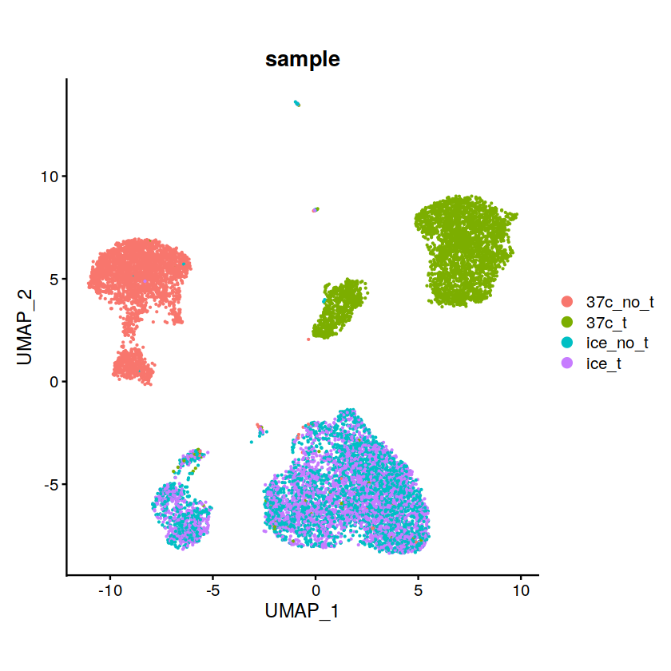

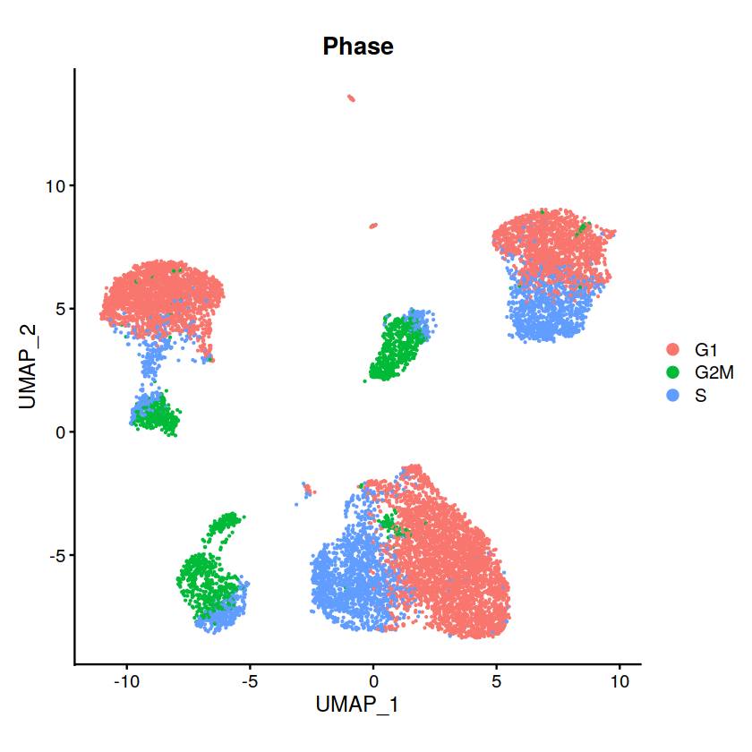

UMAP coloured on metadata

``` r
table(sobj[[]][,c("sample", "Phase")]) %>% as.data.frame.matrix
```

A data.frame: 4 × 3

<table>
<caption>Table 2: Cell cycle phase classification distribution per
condition</caption>
<thead>
<tr class="header">
<th><!--/--></th>
<th>G1 &lt;int&gt;</th>
<th>G2M &lt;int&gt;</th>
<th>S &lt;int&gt;</th>
</tr>
</thead>
<tbody>
<tr class="odd">
<td>37c_no_t</td>
<td>2164</td>
<td>334</td>
<td>375</td>
</tr>
<tr class="even">
<td>37c_t</td>
<td>1799</td>
<td>608</td>
<td>1173</td>
</tr>
<tr class="odd">
<td>ice_no_t</td>
<td>1825</td>
<td>351</td>
<td>872</td>
</tr>
<tr class="even">
<td>ice_t</td>
<td>1760</td>
<td>360</td>
<td>945</td>
</tr>
</tbody>
</table>

Table 2: Cell cycle phase classification distribution per condition

------------------------------------------------------------------------

# Old DEG analysis

From former analysis we performed differential gene expression testing
cell cycle phase-wise. The comparison was between conditions/samples.
This yielded the following set of files:

``` r
system("ls ../data/processed/deg/", intern = T)
```

1.  ‘Archive.zip’
2.  ‘deg_G1_37c_no_t_vs_37c_t.tsv’
3.  ‘deg_G1_ice_no_t_vs_37c_no_t.tsv’
4.  ‘deg_G1_ice_no_t_vs_ice_t.tsv’
5.  ‘deg_G1_ice_t_vs_37c_t.tsv’
6.  ‘deg_G1_ice_vs_37c_no_t.tsv’
7.  ‘deg_G1_ice_vs_37c_t.tsv’
8.  ‘deg_G2M_37c_no_t_vs_37c_t.tsv’
9.  ‘deg_G2M_ice_no_t_vs_37c_no_t.tsv’
10. ‘deg_G2M_ice_no_t_vs_ice_t.tsv’
11. ‘deg_G2M_ice_t_vs_37c_t.tsv’
12. ‘deg_G2M_ice_vs_37c_no_t.tsv’
13. ‘deg_G2M_ice_vs_37c_t.tsv’
14. ‘deg_S_37c_no_t_vs_37c_t.tsv’
15. ‘deg_S_ice_no_t_vs_37c_no_t.tsv’
16. ‘deg_S_ice_no_t_vs_ice_t.tsv’
17. ‘deg_S_ice_t_vs_37c_t.tsv’
18. ‘deg_S_ice_vs_37c_no_t.tsv’
19. ‘deg_S_ice_vs_37c_t.tsv’

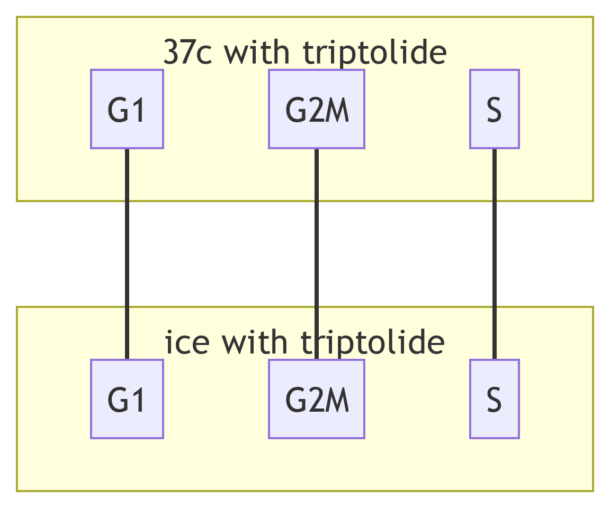

Figure 3: Schema for (old) DEG comparisons to follow.

For each file, both up- and down-regulated genes are included. Here we
have loaded the comparison between 37c with triptolide and ice with
triptolide (see [Figure 3](#fig-diagram)). So first we have the top 6
ice-specific, for the G1 phase:

``` r
degs[["G1"]] %>% head
```

A data.frame: 6 × 5

<table style="width:100%;">
<colgroup>
<col style="width: 16%" />
<col style="width: 16%" />
<col style="width: 16%" />
<col style="width: 16%" />
<col style="width: 16%" />
<col style="width: 16%" />
</colgroup>
<thead>
<tr class="header">
<th><!--/--></th>
<th>p_val &lt;dbl&gt;</th>
<th>avg_log2FC &lt;dbl&gt;</th>
<th>pct.1 &lt;dbl&gt;</th>
<th>pct.2 &lt;dbl&gt;</th>
<th>p_val_adj &lt;dbl&gt;</th>
</tr>
</thead>
<tbody>
<tr class="odd">
<td>Zfp36l2</td>
<td>0</td>
<td>1.958553</td>
<td>0.990</td>
<td>0.439</td>
<td>0</td>
</tr>
<tr class="even">
<td>Mir142hg</td>
<td>0</td>
<td>1.894032</td>
<td>0.962</td>
<td>0.245</td>
<td>0</td>
</tr>
<tr class="odd">
<td>Txnip</td>
<td>0</td>
<td>1.855793</td>
<td>0.945</td>
<td>0.183</td>
<td>0</td>
</tr>
<tr class="even">
<td>Sox4</td>
<td>0</td>
<td>1.635571</td>
<td>0.945</td>
<td>0.458</td>
<td>0</td>
</tr>
<tr class="odd">
<td>Dapp1</td>
<td>0</td>
<td>1.552930</td>
<td>0.966</td>
<td>0.568</td>
<td>0</td>
</tr>
<tr class="even">
<td>Gcnt2</td>
<td>0</td>
<td>1.479956</td>
<td>0.959</td>
<td>0.586</td>
<td>0</td>
</tr>
</tbody>
</table>

And the top 6 37c-specific, for the G1 phase as well:

``` r
degs[["G1"]] %>% tail
```

A data.frame: 6 × 5

<table style="width:100%;">
<colgroup>
<col style="width: 16%" />
<col style="width: 16%" />
<col style="width: 16%" />
<col style="width: 16%" />
<col style="width: 16%" />
<col style="width: 16%" />
</colgroup>
<thead>
<tr class="header">
<th><!--/--></th>
<th>p_val &lt;dbl&gt;</th>
<th>avg_log2FC &lt;dbl&gt;</th>
<th>pct.1 &lt;dbl&gt;</th>
<th>pct.2 &lt;dbl&gt;</th>
<th>p_val_adj &lt;dbl&gt;</th>
</tr>
</thead>
<tbody>
<tr class="odd">
<td>Sh2b2</td>
<td>0.000000e+00</td>
<td>-1.357543</td>
<td>0.093</td>
<td>0.691</td>
<td>0.000000e+00</td>
</tr>
<tr class="even">
<td>A930015D03Rik</td>
<td>3.628043e-15</td>
<td>-1.372958</td>
<td>0.487</td>
<td>0.298</td>
<td>1.171314e-10</td>
</tr>
<tr class="odd">
<td>Asah2</td>
<td>7.332960e-212</td>
<td>-1.375551</td>
<td>0.322</td>
<td>0.723</td>
<td>2.367446e-207</td>
</tr>
<tr class="even">
<td>Bcl2l14</td>
<td>3.884711e-151</td>
<td>-1.661921</td>
<td>0.061</td>
<td>0.419</td>
<td>1.254179e-146</td>
</tr>
<tr class="odd">
<td>Gm40841</td>
<td>0.000000e+00</td>
<td>-1.682257</td>
<td>0.040</td>
<td>0.759</td>
<td>0.000000e+00</td>
</tr>
<tr class="even">
<td>4933406J09Rik</td>
<td>0.000000e+00</td>
<td>-2.247251</td>
<td>0.101</td>
<td>0.844</td>
<td>0.000000e+00</td>
</tr>
</tbody>
</table>

------------------------------------------------------------------------

## DEGs visualized on UMAP

### G1

``` r
FeaturePlot(sobj, features = degs[["G1"]] %>% head %>% rownames, coord.fixed = T, order = T, cols = cols_features)
FeaturePlot(sobj, features = degs[["G1"]] %>% tail %>% rownames, coord.fixed = T, order = T, cols = cols_features)
```

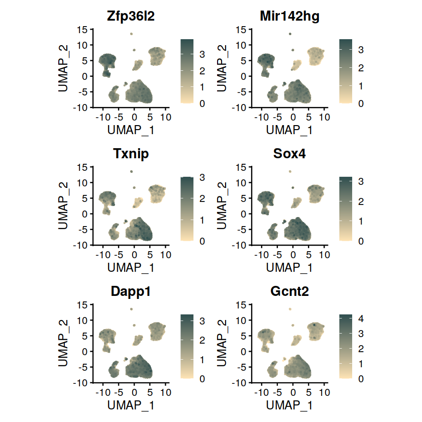

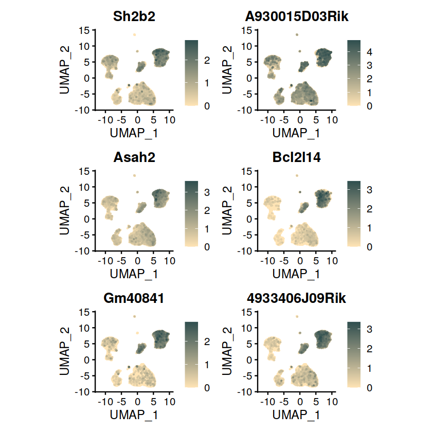

Top DEGs for phase **G1**.

### G2M

``` r
FeaturePlot(sobj, features = degs[["G2M"]] %>% head %>% rownames, coord.fixed = T, order = T, cols = cols_features)
FeaturePlot(sobj, features = degs[["G2M"]] %>% tail %>% rownames, coord.fixed = T, order = T, cols = cols_features)
```

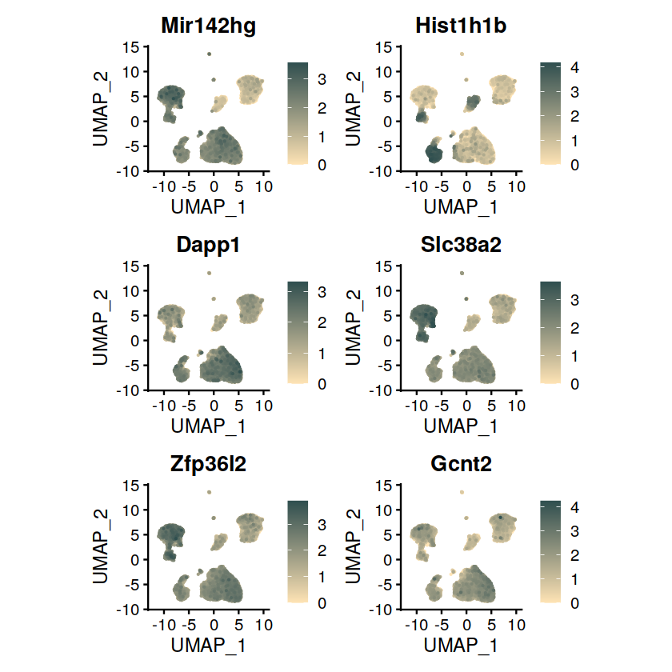

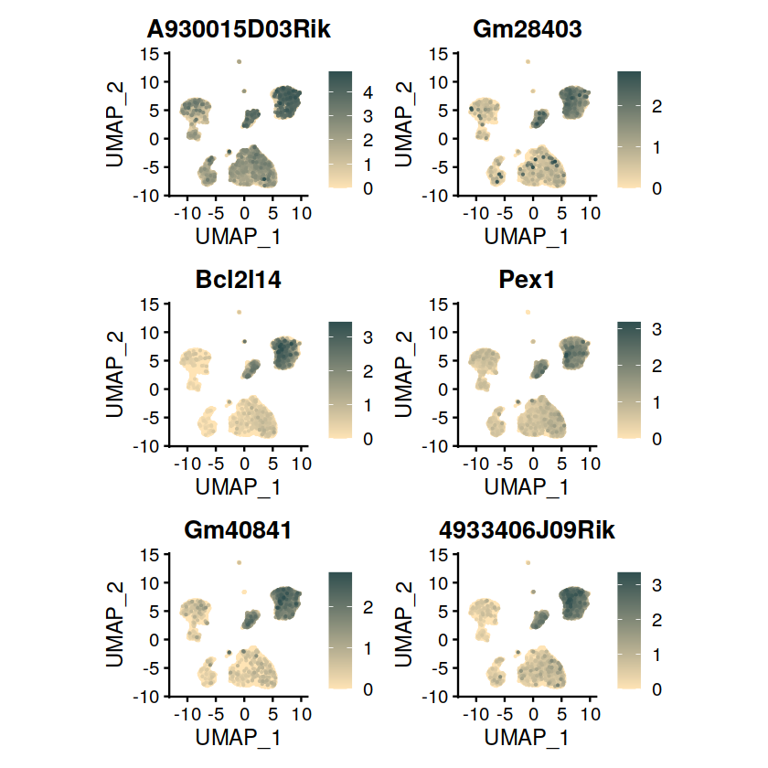

Top DEGs for phase **G2M**.

### S

``` r
FeaturePlot(sobj, features = degs[["S"]] %>% head %>% rownames, coord.fixed = T, order = T, cols = cols_features)
FeaturePlot(sobj, features = degs[["S"]] %>% tail %>% rownames, coord.fixed = T, order = T, cols = cols_features)
```

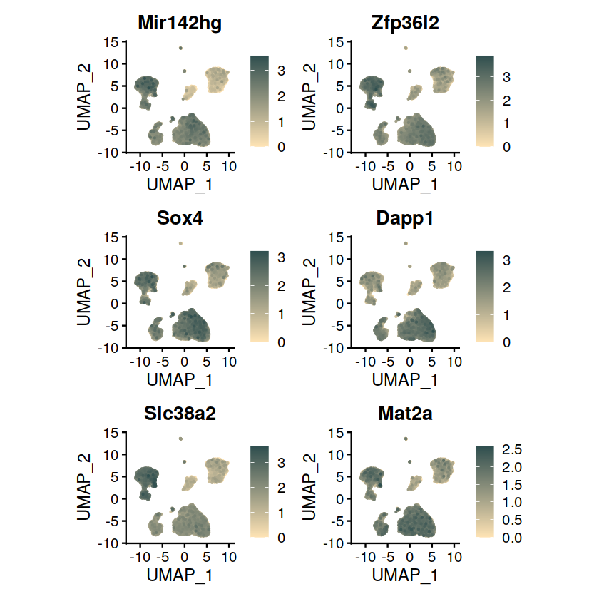

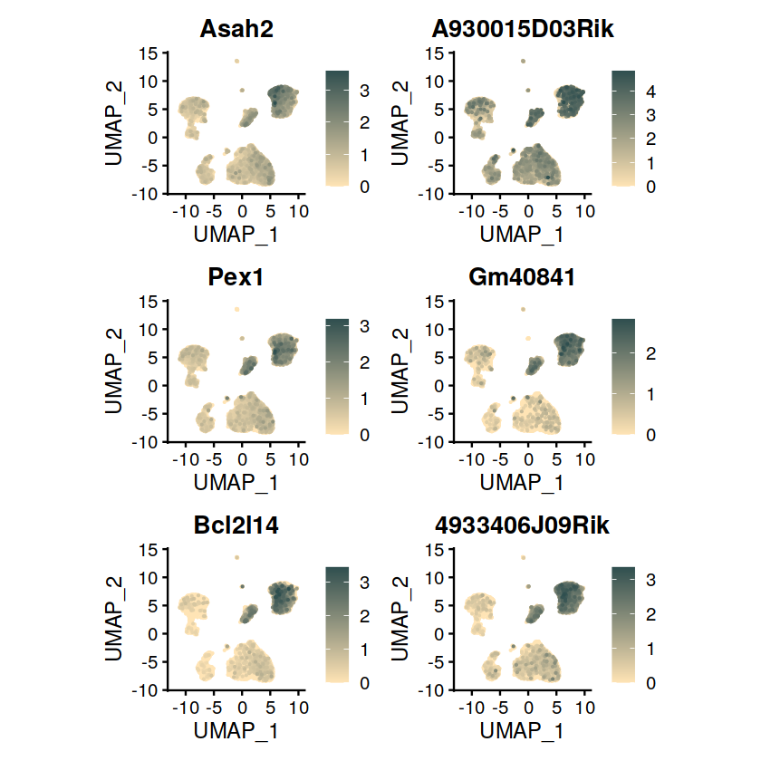

Top DEGs for phase **S**.

------------------------------------------------------------------------

# New DEG analysis

Specifically done *not* cell cycle phase-wise. Will be done for:

-   37c with tript *VS* ice with tript

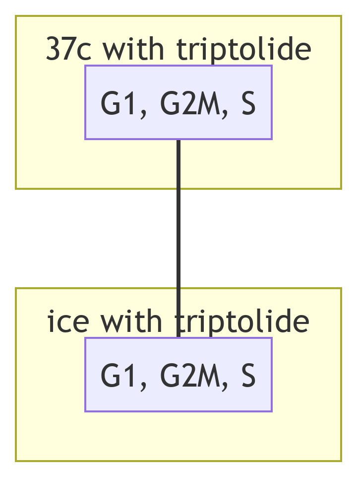

Figure 10: Schema for new DEG comparison.

## 37c with tript *vs* ice with tript

Sample names used in object:

``` r
sobj[[]][["sample"]] %>% unique
```

1.  ‘37c_no_t’
2.  ‘ice_t’
3.  ‘37c_t’
4.  ‘ice_no_t’

``` r
Idents(sobj) <- "sample"
DefaultAssay(sobj) <- "RNA"
new_degs <- FindMarkers(sobj, ident.1 = "37c_t", ident.2 = "ice_t", assay = "RNA", features = VariableFeatures(sobj)) %>% arrange(desc(avg_log2FC))
```

### DEG table

``` r
new_degs
```

A data.frame: 265 × 5

<table style="width:100%;">
<caption>Table 3: Differentially expressed genes between
<code>37c_t</code> and <code>ice_t</code>. Positive fold change = up in
<code>37c_t</code>, negative fold change = up in
<code>ice_t</code>.</caption>
<colgroup>
<col style="width: 16%" />
<col style="width: 16%" />
<col style="width: 16%" />
<col style="width: 16%" />
<col style="width: 16%" />
<col style="width: 16%" />
</colgroup>
<thead>
<tr class="header">
<th><!--/--></th>
<th>p_val &lt;dbl&gt;</th>
<th>avg_log2FC &lt;dbl&gt;</th>
<th>pct.1 &lt;dbl&gt;</th>
<th>pct.2 &lt;dbl&gt;</th>
<th>p_val_adj &lt;dbl&gt;</th>
</tr>
</thead>
<tbody>
<tr class="odd">
<td>4933406J09Rik</td>
<td>0.000000e+00</td>
<td>2.0847480</td>
<td>0.862</td>
<td>0.115</td>
<td>0.000000e+00</td>
</tr>
<tr class="even">
<td>Bcl2l14</td>
<td>0.000000e+00</td>
<td>1.6003084</td>
<td>0.465</td>
<td>0.052</td>
<td>0.000000e+00</td>
</tr>
<tr class="odd">
<td>Gm40841</td>
<td>0.000000e+00</td>
<td>1.5380264</td>
<td>0.771</td>
<td>0.039</td>
<td>0.000000e+00</td>
</tr>
<tr class="even">
<td>A930015D03Rik</td>
<td>3.476910e-33</td>
<td>1.2839138</td>
<td>0.339</td>
<td>0.552</td>
<td>1.122520e-28</td>
</tr>
<tr class="odd">
<td>Sh2b2</td>
<td>0.000000e+00</td>
<td>1.2106941</td>
<td>0.709</td>
<td>0.127</td>
<td>0.000000e+00</td>
</tr>
<tr class="even">
<td>Asah2</td>
<td>0.000000e+00</td>
<td>1.2047546</td>
<td>0.730</td>
<td>0.334</td>
<td>0.000000e+00</td>
</tr>
<tr class="odd">
<td>Arhgap15</td>
<td>0.000000e+00</td>
<td>1.1174486</td>
<td>0.996</td>
<td>0.989</td>
<td>0.000000e+00</td>
</tr>
<tr class="even">
<td>Pex1</td>
<td>0.000000e+00</td>
<td>1.0954294</td>
<td>0.599</td>
<td>0.195</td>
<td>0.000000e+00</td>
</tr>
<tr class="odd">
<td>Gm28403</td>
<td>0.000000e+00</td>
<td>1.0177440</td>
<td>0.566</td>
<td>0.076</td>
<td>0.000000e+00</td>
</tr>
<tr class="even">
<td>Mctp1</td>
<td>9.482904e-216</td>
<td>0.9753501</td>
<td>0.951</td>
<td>0.923</td>
<td>3.061555e-211</td>
</tr>
<tr class="odd">
<td>Ccser1</td>
<td>4.533434e-135</td>
<td>0.9561586</td>
<td>0.773</td>
<td>0.678</td>
<td>1.463619e-130</td>
</tr>
<tr class="even">
<td>4930435F18Rik</td>
<td>0.000000e+00</td>
<td>0.8894889</td>
<td>0.494</td>
<td>0.005</td>
<td>0.000000e+00</td>
</tr>
<tr class="odd">
<td>Diaph3</td>
<td>4.369147e-115</td>
<td>0.8549220</td>
<td>0.699</td>
<td>0.592</td>
<td>1.410579e-110</td>
</tr>
<tr class="even">
<td>Diaph2</td>
<td>9.363747e-142</td>
<td>0.8476800</td>
<td>0.736</td>
<td>0.609</td>
<td>3.023086e-137</td>
</tr>
<tr class="odd">
<td>Cep128</td>
<td>6.111412e-98</td>
<td>0.8312018</td>
<td>0.620</td>
<td>0.509</td>
<td>1.973069e-93</td>
</tr>
<tr class="even">
<td>Gm36431</td>
<td>0.000000e+00</td>
<td>0.8201461</td>
<td>0.396</td>
<td>0.012</td>
<td>0.000000e+00</td>
</tr>
<tr class="odd">
<td>Tmbim7</td>
<td>0.000000e+00</td>
<td>0.8201281</td>
<td>0.425</td>
<td>0.008</td>
<td>0.000000e+00</td>
</tr>
<tr class="even">
<td>Gm5099</td>
<td>0.000000e+00</td>
<td>0.7989243</td>
<td>0.513</td>
<td>0.008</td>
<td>0.000000e+00</td>
</tr>
<tr class="odd">
<td>Pard3b</td>
<td>2.769102e-149</td>
<td>0.7973588</td>
<td>0.875</td>
<td>0.808</td>
<td>8.940047e-145</td>
</tr>
<tr class="even">
<td>Kcnq1ot1</td>
<td>1.714648e-114</td>
<td>0.7565798</td>
<td>0.908</td>
<td>0.864</td>
<td>5.535742e-110</td>
</tr>
<tr class="odd">
<td>Prkg1</td>
<td>4.200709e-63</td>
<td>0.7341202</td>
<td>0.827</td>
<td>0.799</td>
<td>1.356199e-58</td>
</tr>
<tr class="even">
<td>Acot12</td>
<td>0.000000e+00</td>
<td>0.7065082</td>
<td>0.455</td>
<td>0.003</td>
<td>0.000000e+00</td>
</tr>
<tr class="odd">
<td>Fgfr2</td>
<td>4.977226e-110</td>
<td>0.7027180</td>
<td>0.658</td>
<td>0.531</td>
<td>1.606897e-105</td>
</tr>
<tr class="even">
<td>Mir99ahg</td>
<td>1.173616e-66</td>
<td>0.7014709</td>
<td>0.816</td>
<td>0.826</td>
<td>3.789018e-62</td>
</tr>
<tr class="odd">
<td>Rad51b</td>
<td>1.169004e-37</td>
<td>0.6700331</td>
<td>0.572</td>
<td>0.502</td>
<td>3.774131e-33</td>
</tr>
<tr class="even">
<td>Nek10</td>
<td>4.344622e-288</td>
<td>0.6620993</td>
<td>0.373</td>
<td>0.011</td>
<td>1.402661e-283</td>
</tr>
<tr class="odd">
<td>Map3k15</td>
<td>5.950301e-300</td>
<td>0.6444104</td>
<td>0.409</td>
<td>0.026</td>
<td>1.921055e-295</td>
</tr>
<tr class="even">
<td>Gna14</td>
<td>7.698322e-271</td>
<td>0.6443333</td>
<td>0.403</td>
<td>0.041</td>
<td>2.485403e-266</td>
</tr>
<tr class="odd">
<td>Hormad2</td>
<td>1.147156e-251</td>
<td>0.6362092</td>
<td>0.367</td>
<td>0.028</td>
<td>3.703594e-247</td>
</tr>
<tr class="even">
<td>Esr1</td>
<td>1.082358e-81</td>
<td>0.6282468</td>
<td>0.715</td>
<td>0.623</td>
<td>3.494394e-77</td>
</tr>
<tr class="odd">
<td>⋮</td>
<td>⋮</td>
<td>⋮</td>
<td>⋮</td>
<td>⋮</td>
<td>⋮</td>
</tr>
<tr class="even">
<td>Fam111a</td>
<td>4.671189e-242</td>
<td>-0.7086627</td>
<td>0.335</td>
<td>0.679</td>
<td>1.508093e-237</td>
</tr>
<tr class="odd">
<td>Runx1</td>
<td>1.348801e-235</td>
<td>-0.7112591</td>
<td>0.813</td>
<td>0.955</td>
<td>4.354603e-231</td>
</tr>
<tr class="even">
<td>Dleu2</td>
<td>0.000000e+00</td>
<td>-0.7185027</td>
<td>0.207</td>
<td>0.680</td>
<td>0.000000e+00</td>
</tr>
<tr class="odd">
<td>Rps6ka5</td>
<td>2.082905e-307</td>
<td>-0.7386294</td>
<td>0.365</td>
<td>0.764</td>
<td>6.724660e-303</td>
</tr>
<tr class="even">
<td>Zeb2</td>
<td>1.804149e-182</td>
<td>-0.7529491</td>
<td>0.468</td>
<td>0.754</td>
<td>5.824696e-178</td>
</tr>
<tr class="odd">
<td>Gm4258</td>
<td>0.000000e+00</td>
<td>-0.7675290</td>
<td>0.222</td>
<td>0.668</td>
<td>0.000000e+00</td>
</tr>
<tr class="even">
<td>Ltb</td>
<td>9.087834e-167</td>
<td>-0.7731711</td>
<td>0.309</td>
<td>0.636</td>
<td>2.934007e-162</td>
</tr>
<tr class="odd">
<td>Tubb4b</td>
<td>1.347083e-245</td>
<td>-0.7773395</td>
<td>0.443</td>
<td>0.801</td>
<td>4.349059e-241</td>
</tr>
<tr class="even">
<td>Hist1h1e</td>
<td>3.536736e-154</td>
<td>-0.7796415</td>
<td>0.264</td>
<td>0.619</td>
<td>1.141835e-149</td>
</tr>
<tr class="odd">
<td>Ikzf2</td>
<td>5.149385e-243</td>
<td>-0.7877484</td>
<td>0.505</td>
<td>0.819</td>
<td>1.662479e-238</td>
</tr>
<tr class="even">
<td>Calcrl</td>
<td>2.602565e-237</td>
<td>-0.7918211</td>
<td>0.518</td>
<td>0.816</td>
<td>8.402380e-233</td>
</tr>
<tr class="odd">
<td>Fut8</td>
<td>2.539314e-214</td>
<td>-0.8042616</td>
<td>0.680</td>
<td>0.908</td>
<td>8.198174e-210</td>
</tr>
<tr class="even">
<td>Abhd17b</td>
<td>0.000000e+00</td>
<td>-0.8345477</td>
<td>0.186</td>
<td>0.717</td>
<td>0.000000e+00</td>
</tr>
<tr class="odd">
<td>Fli1</td>
<td>0.000000e+00</td>
<td>-0.8746406</td>
<td>0.603</td>
<td>0.916</td>
<td>0.000000e+00</td>
</tr>
<tr class="even">
<td>Hlf</td>
<td>3.186349e-205</td>
<td>-0.8866952</td>
<td>0.817</td>
<td>0.936</td>
<td>1.028713e-200</td>
</tr>
<tr class="odd">
<td>Samsn1</td>
<td>0.000000e+00</td>
<td>-0.9064422</td>
<td>0.785</td>
<td>0.970</td>
<td>0.000000e+00</td>
</tr>
<tr class="even">
<td>Hist1h1b</td>
<td>1.075679e-12</td>
<td>-0.9673167</td>
<td>0.297</td>
<td>0.386</td>
<td>3.472828e-08</td>
</tr>
<tr class="odd">
<td>Igkc</td>
<td>1.736173e-01</td>
<td>-0.9861650</td>
<td>0.429</td>
<td>0.457</td>
<td>1.000000e+00</td>
</tr>
<tr class="even">
<td>Il12a</td>
<td>0.000000e+00</td>
<td>-1.0254985</td>
<td>0.091</td>
<td>0.550</td>
<td>0.000000e+00</td>
</tr>
<tr class="odd">
<td>Myc</td>
<td>0.000000e+00</td>
<td>-1.0260883</td>
<td>0.091</td>
<td>0.675</td>
<td>0.000000e+00</td>
</tr>
<tr class="even">
<td>Etv6</td>
<td>0.000000e+00</td>
<td>-1.0842947</td>
<td>0.947</td>
<td>0.994</td>
<td>0.000000e+00</td>
</tr>
<tr class="odd">
<td>Ikzf1</td>
<td>0.000000e+00</td>
<td>-1.0933579</td>
<td>0.591</td>
<td>0.927</td>
<td>0.000000e+00</td>
</tr>
<tr class="even">
<td>Angpt1</td>
<td>2.649381e-294</td>
<td>-1.1610093</td>
<td>0.954</td>
<td>0.985</td>
<td>8.553526e-290</td>
</tr>
<tr class="odd">
<td>Fchsd2</td>
<td>0.000000e+00</td>
<td>-1.2107342</td>
<td>0.522</td>
<td>0.946</td>
<td>0.000000e+00</td>
</tr>
<tr class="even">
<td>Meis1</td>
<td>0.000000e+00</td>
<td>-1.3478146</td>
<td>0.690</td>
<td>0.969</td>
<td>0.000000e+00</td>
</tr>
<tr class="odd">
<td>Adgrl4</td>
<td>0.000000e+00</td>
<td>-1.3949749</td>
<td>0.931</td>
<td>0.984</td>
<td>0.000000e+00</td>
</tr>
<tr class="even">
<td>Slc38a2</td>
<td>0.000000e+00</td>
<td>-1.3967915</td>
<td>0.419</td>
<td>0.957</td>
<td>0.000000e+00</td>
</tr>
<tr class="odd">
<td>Gcnt2</td>
<td>0.000000e+00</td>
<td>-1.4181788</td>
<td>0.590</td>
<td>0.958</td>
<td>0.000000e+00</td>
</tr>
<tr class="even">
<td>Dapp1</td>
<td>0.000000e+00</td>
<td>-1.5052702</td>
<td>0.630</td>
<td>0.977</td>
<td>0.000000e+00</td>
</tr>
<tr class="odd">
<td>Zfp36l2</td>
<td>0.000000e+00</td>
<td>-1.7229168</td>
<td>0.546</td>
<td>0.992</td>
<td>0.000000e+00</td>
</tr>
</tbody>
</table>

Table 3: Differentially expressed genes between `37c_t` and `ice_t`.
Positive fold change = up in `37c_t`, negative fold change = up in
`ice_t`.

### DEG visualizations

``` r
FeaturePlot(sobj, features = new_degs %>% head %>% rownames, coord.fixed = T, order = T, cols = cols_features)
FeaturePlot(sobj, features = new_degs %>% tail %>% rownames, coord.fixed = T, order = T, cols = cols_features)
```

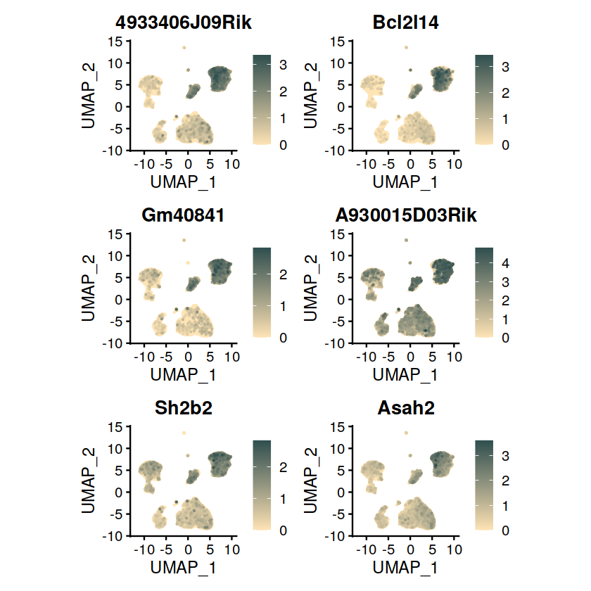

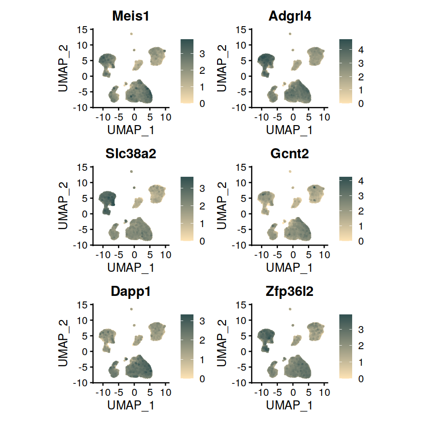

Top DEGs between 37c with triptolide and ice with triptolide.
