# Revision plots, IER manuscript
Rasmus Olofzon

-   [Methods](#methods)
    -   [Differentially expressed genes
        (DEG)](#differentially-expressed-genes-deg)
    -   [Gene signatures](#gene-signatures)
-   [Setup](#setup)
-   [Visualization of dataset with conditions, for
    reference](#visualization-of-dataset-with-conditions-for-reference)
-   [Compare ice conditions](#compare-ice-conditions)
-   [Compare 37c conditions](#compare-37c-conditions)
    -   [Save DEG tables](#save-deg-tables)
    -   [Overlapping DEGs (intersection between cell cycle
        phases)](#overlapping-degs-intersection-between-cell-cycle-phases)
-   [Collated dot plots](#collated-dot-plots)
    -   [Dot plots overlapping DEGs](#dot-plots-overlapping-degs)
-   [QC plots](#qc-plots)
-   [Signatures](#signatures)

------------------------------------------------------------------------

## Methods

### Differentially expressed genes (DEG)

The samples were first compared cell cycle phase-wise, since the dataset
showed clear separation based on phase classification, but its structure
otherwise made biological sense. In the UMAP the two ice conditions
co-located very clearly, which prompted the notion of treating them as
one for the DEG analysis. This was corroborated by a DEG testing between
the two ice conditions, which for the samples as wholes yielded three
DEGs, non with significant p-values. Phase-wise no DEGs were found.

Based off of that, three comparisons were carried out:

1.  37c *with* triptolide VS ice
2.  37c *without* triptolide VS ice
3.  37c *without* triptolide VS 37c *without* triptolide

The comparisons were first made cell cycle phase-wise (G1, G2M, S), then
the intersection of the found DEGs was taken. This would give the
differentially expressed genes that most characterizes a given
condition, without cell cycle-specific genes.

The DEG testing was performed with Seurat’s `FindMarkers` function,
testing performed only on highly variable genes (HVGs). The intersection
was taken with R’s `intersect` function for sets.

### Gene signatures

The gene signature scores were calculated and visualized similar to the
procedure for the IER signature.

------------------------------------------------------------------------

# Setup

``` r
library(Seurat)
library(stringr)
library(dplyr)
library(ggplot2)
```

    Attaching SeuratObject


    Attaching package: ‘dplyr’


    The following objects are masked from ‘package:stats’:

        filter, lag


    The following objects are masked from ‘package:base’:

        intersect, setdiff, setequal, union

``` r
library(tidyr)
library(dplyr)
library(viridis)
```

    Loading required package: viridisLite

``` r
library(patchwork)
```

``` r
sobj <- readRDS("../data/processed/seurat_object_w_stress_sig.rds")
```

``` r
# cols_features <- c("moccasin", "darkslategray")
cols_features <- c("lightgray", "red3")
```

``` r
phases <- list("G1", "G2M", "S")
names(phases) <- phases
phases
```

$G1  
‘G1’ $G2M

‘G2M’ $S

‘S’

------------------------------------------------------------------------

# Visualization of dataset with conditions, for reference

Metadata:

``` r
sobj[[]] %>% head
```

A data.frame: 6 × 21

<table style="width:100%;">
<caption>Table 1: Metadata for dataset</caption>
<colgroup>
<col style="width: 4%" />
<col style="width: 4%" />
<col style="width: 4%" />
<col style="width: 4%" />
<col style="width: 4%" />
<col style="width: 4%" />
<col style="width: 4%" />
<col style="width: 4%" />
<col style="width: 4%" />
<col style="width: 4%" />
<col style="width: 4%" />
<col style="width: 4%" />
<col style="width: 4%" />
<col style="width: 4%" />
<col style="width: 4%" />
<col style="width: 4%" />
<col style="width: 4%" />
<col style="width: 4%" />
<col style="width: 4%" />
<col style="width: 4%" />
<col style="width: 4%" />
<col style="width: 4%" />
</colgroup>
<thead>
<tr class="header">
<th><!--/--></th>
<th>orig.ident &lt;chr&gt;</th>
<th>nCount_RNA &lt;dbl&gt;</th>
<th>nFeature_RNA &lt;int&gt;</th>
<th>nCount_ADT &lt;dbl&gt;</th>
<th>nFeature_ADT &lt;int&gt;</th>
<th>nCount_HTO &lt;dbl&gt;</th>
<th>nFeature_HTO &lt;int&gt;</th>
<th>percent.mt &lt;dbl&gt;</th>
<th>hto &lt;chr&gt;</th>
<th>sample &lt;chr&gt;</th>
<th>⋯ ⋯</th>
<th>buffer_treatment &lt;chr&gt;</th>
<th>incubation_method &lt;chr&gt;</th>
<th>S.Score &lt;dbl&gt;</th>
<th>G2M.Score &lt;dbl&gt;</th>
<th>Phase &lt;chr&gt;</th>
<th>old.ident &lt;fct&gt;</th>
<th>RNA_snn_res.0.8 &lt;fct&gt;</th>
<th>seurat_clusters &lt;fct&gt;</th>
<th>stress_signature1 &lt;dbl&gt;</th>
<th>is_stressed &lt;chr&gt;</th>
</tr>
</thead>
<tbody>
<tr class="odd">
<td>AAACCCAAGAGACAAG-1</td>
<td>DB_AKC_citeseq</td>
<td>11976</td>
<td>3437</td>
<td>128</td>
<td>4</td>
<td>32</td>
<td>3</td>
<td>2.104208</td>
<td>HTO2</td>
<td>37c_no_t</td>
<td>⋯</td>
<td>no_triptolide</td>
<td>37c</td>
<td>-0.2740383</td>
<td>-0.19990412</td>
<td>G1</td>
<td>HTO2</td>
<td>0</td>
<td>0</td>
<td>0.19599848</td>
<td>stressed</td>
</tr>
<tr class="even">
<td>AAACCCAAGAGTGAAG-1</td>
<td>DB_AKC_citeseq</td>
<td>21028</td>
<td>5475</td>
<td>54</td>
<td>4</td>
<td>108</td>
<td>4</td>
<td>2.425338</td>
<td>HTO3</td>
<td>ice_t</td>
<td>⋯</td>
<td>with_triptolide</td>
<td>ice</td>
<td>0.2386460</td>
<td>-0.01205648</td>
<td>S</td>
<td>HTO3</td>
<td>1</td>
<td>1</td>
<td>-0.10710847</td>
<td>not_stressed</td>
</tr>
<tr class="odd">
<td>AAACCCAAGCGAAACC-1</td>
<td>DB_AKC_citeseq</td>
<td>10688</td>
<td>2813</td>
<td>56</td>
<td>3</td>
<td>87</td>
<td>2</td>
<td>4.519087</td>
<td>HTO4</td>
<td>37c_t</td>
<td>⋯</td>
<td>with_triptolide</td>
<td>37c</td>
<td>-0.1966232</td>
<td>-0.14132145</td>
<td>G1</td>
<td>HTO4</td>
<td>5</td>
<td>5</td>
<td>-0.04234327</td>
<td>not_stressed</td>
</tr>
<tr class="even">
<td>AAACCCAAGGTAAAGG-1</td>
<td>DB_AKC_citeseq</td>
<td>10627</td>
<td>3677</td>
<td>68</td>
<td>4</td>
<td>79</td>
<td>4</td>
<td>2.888868</td>
<td>HTO1</td>
<td>ice_no_t</td>
<td>⋯</td>
<td>no_triptolide</td>
<td>ice</td>
<td>-0.1555948</td>
<td>-0.21232288</td>
<td>G1</td>
<td>HTO1</td>
<td>2</td>
<td>2</td>
<td>-0.04919840</td>
<td>not_stressed</td>
</tr>
<tr class="odd">
<td>AAACCCAAGGTCTACT-1</td>
<td>DB_AKC_citeseq</td>
<td>16865</td>
<td>3915</td>
<td>106</td>
<td>4</td>
<td>99</td>
<td>2</td>
<td>2.514082</td>
<td>HTO4</td>
<td>37c_t</td>
<td>⋯</td>
<td>with_triptolide</td>
<td>37c</td>
<td>0.2038750</td>
<td>0.17149954</td>
<td>S</td>
<td>HTO4</td>
<td>7</td>
<td>7</td>
<td>-0.08366769</td>
<td>not_stressed</td>
</tr>
<tr class="even">
<td>AAACCCAAGTCGGCCT-1</td>
<td>DB_AKC_citeseq</td>
<td>13939</td>
<td>4192</td>
<td>60</td>
<td>3</td>
<td>75</td>
<td>2</td>
<td>3.285745</td>
<td>HTO3</td>
<td>ice_t</td>
<td>⋯</td>
<td>with_triptolide</td>
<td>ice</td>
<td>-0.3008664</td>
<td>-0.25975436</td>
<td>G1</td>
<td>HTO3</td>
<td>2</td>
<td>2</td>
<td>-0.09381362</td>
<td>not_stressed</td>
</tr>
</tbody>
</table>

Table 1: Metadata for dataset

``` r
DimPlot(sobj, group.by = "sample") + coord_fixed()
DimPlot(sobj, group.by = "Phase") + coord_fixed()
```

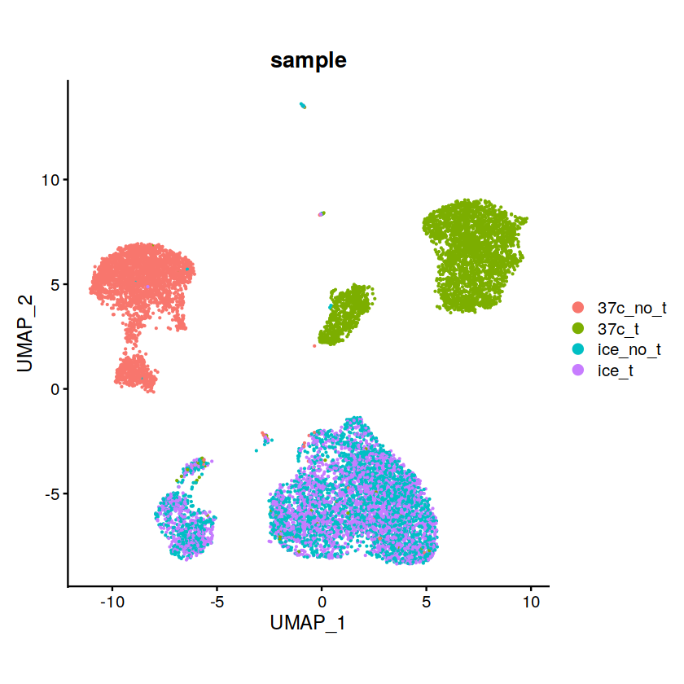

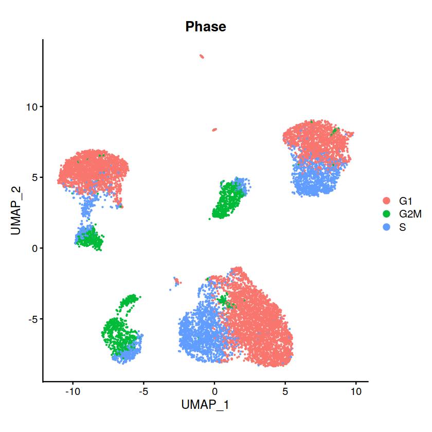

UMAP coloured on metadata

``` r
df <- table(sobj[[]][,c("sample", "Phase")]) %>% as.data.frame.matrix #%>% rbind(
# table(sobj[[]][,c("sample")]) %>% as.list
# )
df
```

A data.frame: 4 × 3

<table>
<thead>
<tr class="header">
<th><!--/--></th>
<th>G1 &lt;int&gt;</th>
<th>G2M &lt;int&gt;</th>
<th>S &lt;int&gt;</th>
</tr>
</thead>
<tbody>
<tr class="odd">
<td>37c_no_t</td>
<td>2164</td>
<td>334</td>
<td>375</td>
</tr>
<tr class="even">
<td>37c_t</td>
<td>1799</td>
<td>608</td>
<td>1173</td>
</tr>
<tr class="odd">
<td>ice_no_t</td>
<td>1825</td>
<td>351</td>
<td>872</td>
</tr>
<tr class="even">
<td>ice_t</td>
<td>1760</td>
<td>360</td>
<td>945</td>
</tr>
</tbody>
</table>

``` r
df[["sample"]] <- table(sobj[["sample"]]) %>% as.list %>% as.numeric
df
```

A data.frame: 4 × 4

<table>
<colgroup>
<col style="width: 20%" />
<col style="width: 20%" />
<col style="width: 20%" />
<col style="width: 20%" />
<col style="width: 20%" />
</colgroup>
<thead>
<tr class="header">
<th><!--/--></th>
<th>G1 &lt;int&gt;</th>
<th>G2M &lt;int&gt;</th>
<th>S &lt;int&gt;</th>
<th>sample &lt;dbl&gt;</th>
</tr>
</thead>
<tbody>
<tr class="odd">
<td>37c_no_t</td>
<td>2164</td>
<td>334</td>
<td>375</td>
<td>2873</td>
</tr>
<tr class="even">
<td>37c_t</td>
<td>1799</td>
<td>608</td>
<td>1173</td>
<td>3580</td>
</tr>
<tr class="odd">
<td>ice_no_t</td>
<td>1825</td>
<td>351</td>
<td>872</td>
<td>3048</td>
</tr>
<tr class="even">
<td>ice_t</td>
<td>1760</td>
<td>360</td>
<td>945</td>
<td>3065</td>
</tr>
</tbody>
</table>

``` r
df <- df %>% mutate(
    G1_frac = round(G1 / sample, digits = 2),
    G2M_frac = round(G2M / sample, digits = 2),
    S_frac = round(S / sample, digits = 2),
)
df
```

A data.frame: 4 × 7

<table>
<colgroup>
<col style="width: 12%" />
<col style="width: 12%" />
<col style="width: 12%" />
<col style="width: 12%" />
<col style="width: 12%" />
<col style="width: 12%" />
<col style="width: 12%" />
<col style="width: 12%" />
</colgroup>
<thead>
<tr class="header">
<th><!--/--></th>
<th>G1 &lt;int&gt;</th>
<th>G2M &lt;int&gt;</th>
<th>S &lt;int&gt;</th>
<th>sample &lt;dbl&gt;</th>
<th>G1_frac &lt;dbl&gt;</th>
<th>G2M_frac &lt;dbl&gt;</th>
<th>S_frac &lt;dbl&gt;</th>
</tr>
</thead>
<tbody>
<tr class="odd">
<td>37c_no_t</td>
<td>2164</td>
<td>334</td>
<td>375</td>
<td>2873</td>
<td>0.75</td>
<td>0.12</td>
<td>0.13</td>
</tr>
<tr class="even">
<td>37c_t</td>
<td>1799</td>
<td>608</td>
<td>1173</td>
<td>3580</td>
<td>0.50</td>
<td>0.17</td>
<td>0.33</td>
</tr>
<tr class="odd">
<td>ice_no_t</td>
<td>1825</td>
<td>351</td>
<td>872</td>
<td>3048</td>
<td>0.60</td>
<td>0.12</td>
<td>0.29</td>
</tr>
<tr class="even">
<td>ice_t</td>
<td>1760</td>
<td>360</td>
<td>945</td>
<td>3065</td>
<td>0.57</td>
<td>0.12</td>
<td>0.31</td>
</tr>
</tbody>
</table>

``` r
df <- table(sobj[[]][,c("sample", "Phase")]) %>% as.data.frame.matrix #%>% rbind(
# table(sobj[[]][,c("sample")]) %>% as.list
# )
df
df <- df %>% tibble::rownames_to_column(var = "sample") %>% pivot_longer(cols = c("G1", "G2M", "S"), names_to = "phase", values_to="n_cells")
df
```

A data.frame: 4 × 3

<table>
<thead>
<tr class="header">
<th><!--/--></th>
<th>G1 &lt;int&gt;</th>
<th>G2M &lt;int&gt;</th>
<th>S &lt;int&gt;</th>
</tr>
</thead>
<tbody>
<tr class="odd">
<td>37c_no_t</td>
<td>2164</td>
<td>334</td>
<td>375</td>
</tr>
<tr class="even">
<td>37c_t</td>
<td>1799</td>
<td>608</td>
<td>1173</td>
</tr>
<tr class="odd">
<td>ice_no_t</td>
<td>1825</td>
<td>351</td>
<td>872</td>
</tr>
<tr class="even">
<td>ice_t</td>
<td>1760</td>
<td>360</td>
<td>945</td>
</tr>
</tbody>
</table>

A tibble: 12 × 3

<table>
<thead>
<tr class="header">
<th>sample &lt;chr&gt;</th>
<th>phase &lt;chr&gt;</th>
<th>n_cells &lt;int&gt;</th>
</tr>
</thead>
<tbody>
<tr class="odd">
<td>37c_no_t</td>
<td>G1</td>
<td>2164</td>
</tr>
<tr class="even">
<td>37c_no_t</td>
<td>G2M</td>
<td>334</td>
</tr>
<tr class="odd">
<td>37c_no_t</td>
<td>S</td>
<td>375</td>
</tr>
<tr class="even">
<td>37c_t</td>
<td>G1</td>
<td>1799</td>
</tr>
<tr class="odd">
<td>37c_t</td>
<td>G2M</td>
<td>608</td>
</tr>
<tr class="even">
<td>37c_t</td>
<td>S</td>
<td>1173</td>
</tr>
<tr class="odd">
<td>ice_no_t</td>
<td>G1</td>
<td>1825</td>
</tr>
<tr class="even">
<td>ice_no_t</td>
<td>G2M</td>
<td>351</td>
</tr>
<tr class="odd">
<td>ice_no_t</td>
<td>S</td>
<td>872</td>
</tr>
<tr class="even">
<td>ice_t</td>
<td>G1</td>
<td>1760</td>
</tr>
<tr class="odd">
<td>ice_t</td>
<td>G2M</td>
<td>360</td>
</tr>
<tr class="even">
<td>ice_t</td>
<td>S</td>
<td>945</td>
</tr>
</tbody>
</table>

Cell cycle phase classification distribution per condition

``` r
ggplot(df, aes(fill=phase, y=n_cells, x=sample)) + 
    geom_bar(position="fill", stat="identity") +
    scale_fill_viridis(discrete = T, option = "cividis") +
    ylab("") +
    xlab("Condition")
ggsave(last_plot(), filename = "plots/cc_phase_distribution_per_condition.svg", device = "svg", units = "in", width = 6, height = 6)
```

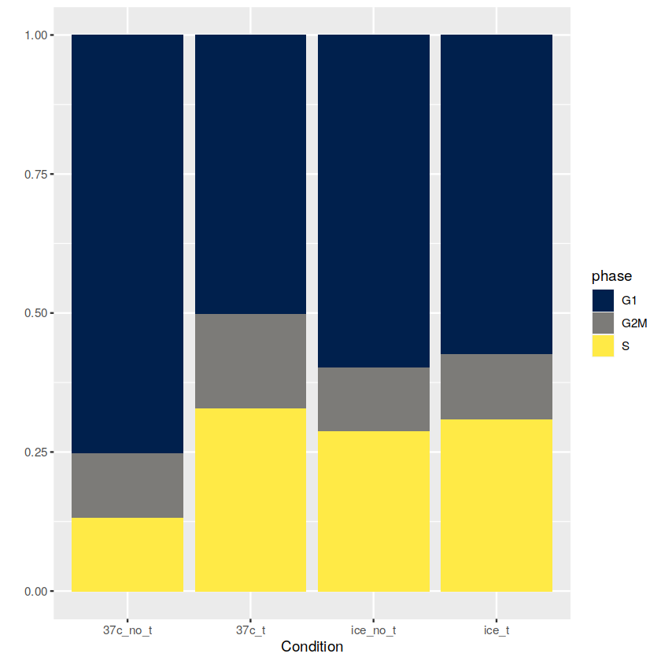

# Compare ice conditions

``` r
WhichCells(sobj, expr = sample == "ice_t" & Phase == "S") %>% length
```

945

``` r
Idents(sobj) <- "sample"
DefaultAssay(sobj) <- "RNA"
degs <- FindMarkers(
    sobj,
    ident.1 = "ice_t",
    ident.2 = "ice_no_t",
    assay = "RNA",
    features = VariableFeatures(sobj)
) %>% arrange(desc(avg_log2FC))
degs
```

A data.frame: 3 × 5

<table style="width:100%;">
<colgroup>
<col style="width: 16%" />
<col style="width: 16%" />
<col style="width: 16%" />
<col style="width: 16%" />
<col style="width: 16%" />
<col style="width: 16%" />
</colgroup>
<thead>
<tr class="header">
<th><!--/--></th>
<th>p_val &lt;dbl&gt;</th>
<th>avg_log2FC &lt;dbl&gt;</th>
<th>pct.1 &lt;dbl&gt;</th>
<th>pct.2 &lt;dbl&gt;</th>
<th>p_val_adj &lt;dbl&gt;</th>
</tr>
</thead>
<tbody>
<tr class="odd">
<td>C77080</td>
<td>0.21988781</td>
<td>-0.2606570</td>
<td>0.285</td>
<td>0.293</td>
<td>1</td>
</tr>
<tr class="even">
<td>Ighm</td>
<td>0.05580379</td>
<td>-0.6127761</td>
<td>0.530</td>
<td>0.536</td>
<td>1</td>
</tr>
<tr class="odd">
<td>Igkc</td>
<td>0.32788650</td>
<td>-0.6539980</td>
<td>0.457</td>
<td>0.464</td>
<td>1</td>
</tr>
</tbody>
</table>

So, only three DEGs, with insignificant p-values. Should probably be a
good argument for treating them as one for this.

``` r
get_degs_cc_wise <- \(idents = "sample", group_1 = "ice_t", group_2 = c("ice_t", "ice_no_t"), cc_phase = "S") {
    Idents(sobj) <- idents
    DefaultAssay(sobj) <- "RNA"

    # extract cell groups:
    cells_1 = WhichCells(sobj, expr = sample %in% group_1 & Phase == cc_phase)
    cells_2 = WhichCells(sobj, expr = sample %in% group_2 & Phase == cc_phase)
    foo_1 <- table(sobj[[]][cells_1,c("sample", "Phase")]) %>% as.data.frame.matrix
    foo_2 <- table(sobj[[]][cells_2,c("sample", "Phase")]) %>% as.data.frame.matrix

    # double-check that the correct cell groups are extracted,
    # will throw an error and fail if they are not correct:
    stopifnot(phase_distributions[group_2, cc_phase] == foo_2[group_2, cc_phase])

    degs <- FindMarkers(
        sobj[["RNA"]],
        cells.1 = cells_1,
        cells.2 = cells_2,
        features = VariableFeatures(sobj)
    ) %>% arrange(desc(avg_log2FC))
    degs %>% return
}
```

``` r
get_degs_cc_wise(group_1 = "ice_t", group_2 = "ice_no_t", cc_phase = "S")
get_degs_cc_wise(group_1 = "ice_t", group_2 = "ice_no_t", cc_phase = "G1")
get_degs_cc_wise(group_1 = "ice_t", group_2 = "ice_no_t", cc_phase = "G2M")
```

    Warning message in FindMarkers.default(object = data.use, slot = data.slot, counts = counts, :
    “No features pass logfc.threshold threshold; returning empty data.frame”
    Warning message in FindMarkers.default(object = data.use, slot = data.slot, counts = counts, :
    “No features pass logfc.threshold threshold; returning empty data.frame”
    Warning message in FindMarkers.default(object = data.use, slot = data.slot, counts = counts, :
    “No features pass logfc.threshold threshold; returning empty data.frame”

A data.frame: 0 × 3

<table>
<thead>
<tr class="header">
<th>avg_log2FC &lt;dbl&gt;</th>
<th>pct.1 &lt;dbl&gt;</th>
<th>pct.2 &lt;dbl&gt;</th>
</tr>
</thead>
<tbody>
</tbody>
</table>

A data.frame: 0 × 3

<table>
<thead>
<tr class="header">
<th>avg_log2FC &lt;dbl&gt;</th>
<th>pct.1 &lt;dbl&gt;</th>
<th>pct.2 &lt;dbl&gt;</th>
</tr>
</thead>
<tbody>
</tbody>
</table>

A data.frame: 0 × 3

<table>
<thead>
<tr class="header">
<th>avg_log2FC &lt;dbl&gt;</th>
<th>pct.1 &lt;dbl&gt;</th>
<th>pct.2 &lt;dbl&gt;</th>
</tr>
</thead>
<tbody>
</tbody>
</table>

So yeah, no DEGs at all doing it phase-wise.

# Compare 37c conditions

``` r
sobj[[]][["sample"]] %>% unique
```

1.  ‘37c_no_t’
2.  ‘ice_t’
3.  ‘37c_t’
4.  ‘ice_no_t’

-   37c_t vs ice
-   37c_no_t vs ice
-   37c_t vs 37c_no_t

``` r
ice <- c("ice_t", "ice_no_t")
comparisons <- list(
    "37c_t" = list("37c_t", ice),
    "37c_no_t" = list("37c_no_t", ice),
    "37c_t_vs_no_t" = list("37c_t", "37c_no_t")
)
# degs <- list(
#     "37c_t" = "",
#     "37c_no_t" = "",
#     "37c_t_vs_no_t" = ""
# )
comparisons
# degs
```

$`37c_t`  
1.  ‘37c_t’

2.  1.  ‘ice_t’

3.  ‘ice_no_t’

$`37c_no_t`  
1.  ‘37c_no_t’

2.  1.  ‘ice_t’

3.  ‘ice_no_t’

$`37c_t_vs_no_t`  
1.  ‘37c_t’
2.  ‘37c_no_t’

``` r
get_degs_cc_wise(group_1 = comparisons[["37c_t"]][[1]], group_2 = comparisons[["37c_t"]][[2]], cc_phase = "S") %>% head
```

A data.frame: 6 × 5

<table style="width:100%;">
<colgroup>
<col style="width: 16%" />
<col style="width: 16%" />
<col style="width: 16%" />
<col style="width: 16%" />
<col style="width: 16%" />
<col style="width: 16%" />
</colgroup>
<thead>
<tr class="header">
<th><!--/--></th>
<th>p_val &lt;dbl&gt;</th>
<th>avg_log2FC &lt;dbl&gt;</th>
<th>pct.1 &lt;dbl&gt;</th>
<th>pct.2 &lt;dbl&gt;</th>
<th>p_val_adj &lt;dbl&gt;</th>
</tr>
</thead>
<tbody>
<tr class="odd">
<td>4933406J09Rik</td>
<td>0.000000e+00</td>
<td>1.0673711</td>
<td>0.882</td>
<td>0.111</td>
<td>0.000000e+00</td>
</tr>
<tr class="even">
<td>Gm40841</td>
<td>0.000000e+00</td>
<td>0.8333755</td>
<td>0.777</td>
<td>0.034</td>
<td>0.000000e+00</td>
</tr>
<tr class="odd">
<td>Bcl2l14</td>
<td>4.972059e-238</td>
<td>0.8190220</td>
<td>0.552</td>
<td>0.038</td>
<td>1.605229e-233</td>
</tr>
<tr class="even">
<td>Pex1</td>
<td>2.962626e-229</td>
<td>0.6778770</td>
<td>0.708</td>
<td>0.216</td>
<td>9.564839e-225</td>
</tr>
<tr class="odd">
<td>Sh2b2</td>
<td>8.265819e-252</td>
<td>0.6284175</td>
<td>0.713</td>
<td>0.173</td>
<td>2.668620e-247</td>
</tr>
<tr class="even">
<td>Gm28403</td>
<td>1.804430e-224</td>
<td>0.5924536</td>
<td>0.609</td>
<td>0.087</td>
<td>5.825601e-220</td>
</tr>
</tbody>
</table>

``` r
phase_distributions <- table(sobj[[]][,c("sample", "Phase")]) %>% as.data.frame.matrix #%>% rbind(
phase_distributions
```

A data.frame: 4 × 3

<table>
<thead>
<tr class="header">
<th><!--/--></th>
<th>G1 &lt;int&gt;</th>
<th>G2M &lt;int&gt;</th>
<th>S &lt;int&gt;</th>
</tr>
</thead>
<tbody>
<tr class="odd">
<td>37c_no_t</td>
<td>2164</td>
<td>334</td>
<td>375</td>
</tr>
<tr class="even">
<td>37c_t</td>
<td>1799</td>
<td>608</td>
<td>1173</td>
</tr>
<tr class="odd">
<td>ice_no_t</td>
<td>1825</td>
<td>351</td>
<td>872</td>
</tr>
<tr class="even">
<td>ice_t</td>
<td>1760</td>
<td>360</td>
<td>945</td>
</tr>
</tbody>
</table>

``` r
degs <- lapply(comparisons, FUN = \(comp) {
    lapply(phases, FUN = \(phase) {
        group_1 <- comp[[1]]
        group_2 <- comp[[2]]
        print(group_1)
        print(group_2)
        print(phase)
        cells_1 = WhichCells(sobj, expr = sample %in% group_1 & Phase == phase)
        cells_2 = WhichCells(sobj, expr = sample %in% group_2 & Phase == phase)
        print(length(cells_1))
        print(length(cells_2))
        foo_1 <- table(sobj[[]][cells_1,c("sample", "Phase")]) %>% as.data.frame.matrix
        foo_2 <- table(sobj[[]][cells_2,c("sample", "Phase")]) %>% as.data.frame.matrix
        print(foo_1)
        print(foo_2)
        stopifnot(phase_distributions[group_2, phase] == foo_2[group_2, phase])
        print("------")
    })
})
```

    [1] "37c_t"
    [1] "ice_t"    "ice_no_t"
    [1] "G1"
    [1] 1799
    [1] 3585
            G1
    37c_t 1799
               G1
    ice_no_t 1825
    ice_t    1760
    [1] "------"
    [1] "37c_t"
    [1] "ice_t"    "ice_no_t"
    [1] "G2M"
    [1] 608
    [1] 711
          G2M
    37c_t 608
             G2M
    ice_no_t 351
    ice_t    360
    [1] "------"
    [1] "37c_t"
    [1] "ice_t"    "ice_no_t"
    [1] "S"
    [1] 1173
    [1] 1817
             S
    37c_t 1173
               S
    ice_no_t 872
    ice_t    945
    [1] "------"
    [1] "37c_no_t"
    [1] "ice_t"    "ice_no_t"
    [1] "G1"
    [1] 2164
    [1] 3585
               G1
    37c_no_t 2164
               G1
    ice_no_t 1825
    ice_t    1760
    [1] "------"
    [1] "37c_no_t"
    [1] "ice_t"    "ice_no_t"
    [1] "G2M"
    [1] 334
    [1] 711
             G2M
    37c_no_t 334
             G2M
    ice_no_t 351
    ice_t    360
    [1] "------"
    [1] "37c_no_t"
    [1] "ice_t"    "ice_no_t"
    [1] "S"
    [1] 375
    [1] 1817
               S
    37c_no_t 375
               S
    ice_no_t 872
    ice_t    945
    [1] "------"
    [1] "37c_t"
    [1] "37c_no_t"
    [1] "G1"
    [1] 1799
    [1] 2164
            G1
    37c_t 1799
               G1
    37c_no_t 2164
    [1] "------"
    [1] "37c_t"
    [1] "37c_no_t"
    [1] "G2M"
    [1] 608
    [1] 334
          G2M
    37c_t 608
             G2M
    37c_no_t 334
    [1] "------"
    [1] "37c_t"
    [1] "37c_no_t"
    [1] "S"
    [1] 1173
    [1] 375
             S
    37c_t 1173
               S
    37c_no_t 375
    [1] "------"

``` r
degs <- lapply(comparisons, FUN = \(comp) {
    lapply(phases, FUN = \(phase) {
        get_degs_cc_wise(group_1 = comp[[1]], group_2 = comp[[2]], cc_phase = phase)
    })
})
```

``` r
names(degs)
names(degs[["37c_t"]])
```

1.  ‘37c_t’
2.  ‘37c_no_t’
3.  ‘37c_t_vs_no_t’

<!-- -->

1.  ‘G1’
2.  ‘G2M’
3.  ‘S’

``` r
degs[["37c_t"]][["S"]] %>% head
degs[["37c_t_vs_no_t"]][["S"]] %>% head
```

A data.frame: 6 × 5

<table style="width:100%;">
<colgroup>
<col style="width: 16%" />
<col style="width: 16%" />
<col style="width: 16%" />
<col style="width: 16%" />
<col style="width: 16%" />
<col style="width: 16%" />
</colgroup>
<thead>
<tr class="header">
<th><!--/--></th>
<th>p_val &lt;dbl&gt;</th>
<th>avg_log2FC &lt;dbl&gt;</th>
<th>pct.1 &lt;dbl&gt;</th>
<th>pct.2 &lt;dbl&gt;</th>
<th>p_val_adj &lt;dbl&gt;</th>
</tr>
</thead>
<tbody>
<tr class="odd">
<td>4933406J09Rik</td>
<td>0.000000e+00</td>
<td>1.0673711</td>
<td>0.882</td>
<td>0.111</td>
<td>0.000000e+00</td>
</tr>
<tr class="even">
<td>Gm40841</td>
<td>0.000000e+00</td>
<td>0.8333755</td>
<td>0.777</td>
<td>0.034</td>
<td>0.000000e+00</td>
</tr>
<tr class="odd">
<td>Bcl2l14</td>
<td>4.972059e-238</td>
<td>0.8190220</td>
<td>0.552</td>
<td>0.038</td>
<td>1.605229e-233</td>
</tr>
<tr class="even">
<td>Pex1</td>
<td>2.962626e-229</td>
<td>0.6778770</td>
<td>0.708</td>
<td>0.216</td>
<td>9.564839e-225</td>
</tr>
<tr class="odd">
<td>Sh2b2</td>
<td>8.265819e-252</td>
<td>0.6284175</td>
<td>0.713</td>
<td>0.173</td>
<td>2.668620e-247</td>
</tr>
<tr class="even">
<td>Gm28403</td>
<td>1.804430e-224</td>
<td>0.5924536</td>
<td>0.609</td>
<td>0.087</td>
<td>5.825601e-220</td>
</tr>
</tbody>
</table>

A data.frame: 6 × 5

<table style="width:100%;">
<colgroup>
<col style="width: 16%" />
<col style="width: 16%" />
<col style="width: 16%" />
<col style="width: 16%" />
<col style="width: 16%" />
<col style="width: 16%" />
</colgroup>
<thead>
<tr class="header">
<th><!--/--></th>
<th>p_val &lt;dbl&gt;</th>
<th>avg_log2FC &lt;dbl&gt;</th>
<th>pct.1 &lt;dbl&gt;</th>
<th>pct.2 &lt;dbl&gt;</th>
<th>p_val_adj &lt;dbl&gt;</th>
</tr>
</thead>
<tbody>
<tr class="odd">
<td>4933406J09Rik</td>
<td>9.915117e-148</td>
<td>1.1079427</td>
<td>0.882</td>
<td>0.061</td>
<td>3.201096e-143</td>
</tr>
<tr class="even">
<td>Bcl2l14</td>
<td>6.146130e-70</td>
<td>0.8325183</td>
<td>0.552</td>
<td>0.016</td>
<td>1.984278e-65</td>
</tr>
<tr class="odd">
<td>Gm40841</td>
<td>7.159824e-116</td>
<td>0.8210346</td>
<td>0.777</td>
<td>0.053</td>
<td>2.311549e-111</td>
</tr>
<tr class="even">
<td>Asah2</td>
<td>2.039055e-88</td>
<td>0.6908264</td>
<td>0.731</td>
<td>0.192</td>
<td>6.583087e-84</td>
</tr>
<tr class="odd">
<td>Pex1</td>
<td>6.065907e-81</td>
<td>0.6889232</td>
<td>0.708</td>
<td>0.205</td>
<td>1.958378e-76</td>
</tr>
<tr class="even">
<td>Gm28403</td>
<td>5.746071e-72</td>
<td>0.6102455</td>
<td>0.609</td>
<td>0.067</td>
<td>1.855119e-67</td>
</tr>
</tbody>
</table>

## Save DEG tables

``` r
write.csv(degs[["37c_t"]][["S"]], file = "plots/1.tsv")
```

``` r
lapply(names(comparisons), FUN = \(comp) {
    comp_name <- comp
    comp <- comparisons[[comp_name]]
    if (length(comp[[2]] > 1)) comp[[2]] <- str_flatten(comp[[2]], "_")
    # print(">>>>>>>>>>>>>>>>>>>>>>>>>>>>>>>>>>>>>>>")
    # print(comp_name)
    # print(comp)
    lapply(phases, FUN = \(phase) {
        # print(comp)
        # print(phase)
        filename <- str_c(
            "plots/", comp[[1]], "_VS_", comp[[2]], "_phase_", phase, ".tsv"
        )
        print(filename)
        # print(dim(degs[[comp_name]][[phase]]))
        # print(head(degs[[comp_name]][[phase]]))
        # print("------")
        write.csv(degs[[comp_name]][[phase]], file = filename)
        # return(file.exists(filename))
        return(dim(degs[[comp_name]][[phase]]))
    })
})
```

    [1] "plots/37c_t_VS_ice_t_ice_no_t_phase_G1.tsv"
    [1] "plots/37c_t_VS_ice_t_ice_no_t_phase_G2M.tsv"
    [1] "plots/37c_t_VS_ice_t_ice_no_t_phase_S.tsv"
    [1] "plots/37c_no_t_VS_ice_t_ice_no_t_phase_G1.tsv"
    [1] "plots/37c_no_t_VS_ice_t_ice_no_t_phase_G2M.tsv"
    [1] "plots/37c_no_t_VS_ice_t_ice_no_t_phase_S.tsv"
    [1] "plots/37c_t_VS_37c_no_t_phase_G1.tsv"
    [1] "plots/37c_t_VS_37c_no_t_phase_G2M.tsv"
    [1] "plots/37c_t_VS_37c_no_t_phase_S.tsv"

1.  $G1  
    1.  127

2.  5

$G2M  
1.  153
2.  5

$S  
1.  136
2.  5

2\. $G1  
1.  181
2.  5

$G2M  
1.  194
2.  5

$S  
1.  173
2.  5

3\. $G1  
1.  255
2.  5

$G2M  
1.  268
2.  5

$S  
1.  303
2.  5

## Overlapping DEGs (intersection between cell cycle phases)

``` r
comparisons
```

$`37c_t`  
1.  ‘37c_t’

2.  1.  ‘ice_t’

3.  ‘ice_no_t’

$`37c_no_t`  
1.  ‘37c_no_t’

2.  1.  ‘ice_t’

3.  ‘ice_no_t’

$`37c_t_vs_no_t`  
1.  ‘37c_t’
2.  ‘37c_no_t’

``` r
tmp <- lapply(degs[["37c_t"]], rownames)
lapply(tmp, length)
intersect(tmp[["G1"]], tmp[["G2M"]]) %>% length
intersect(tmp[["G1"]], tmp[["S"]]) %>% length
intersect(tmp[["S"]], tmp[["G2M"]]) %>% length

a <- intersect(tmp[["G1"]], tmp[["G2M"]])
b <- intersect(tmp[["G1"]], tmp[["S"]])
c <- intersect(tmp[["S"]], tmp[["G2M"]])

intersect(a, intersect(b, c)) %>% length
intersect(a, intersect(b, c))
```

$G1  
127 $G2M

153 $S

136

91

95

106

84

1.  ‘4933406J09Rik’
2.  ‘Gm40841’
3.  ‘Sh2b2’
4.  ‘Bcl2l14’
5.  ‘Asah2’
6.  ‘4930435F18Rik’
7.  ‘Gm28403’
8.  ‘Gm5099’
9.  ‘Pex1’
10. ‘Acot12’
11. ‘Gm36431’
12. ‘Map3k15’
13. ‘Nek10’
14. ‘Mctp1’
15. ‘Diaph2’
16. ‘Tmbim7’
17. ‘Hormad2’
18. ‘Gna14’
19. ‘Pard3b’
20. ‘Arhgap15’
21. ‘A430010J10Rik’
22. ‘Gm30551’
23. ‘1700109H08Rik’
24. ‘Kcnq1ot1’
25. ‘Lepr’
26. ‘Slc12a8’
27. ‘Fgfr2’
28. ‘C130071C03Rik’
29. ‘Esr1’
30. ‘Sugct’
31. ‘Ubr2’
32. ‘Tgfbr1’
33. ‘Pml’
34. ‘Lyst’
35. ‘Atp10a’
36. ‘Dyrk1a’
37. ‘Fbxo11’
38. ‘Fam111a’
39. ‘Tbxas1’
40. ‘Comt’
41. ‘BC035044’
42. ‘Parp8’
43. ‘Gm15261’
44. ‘Ssh2’
45. ‘Dnajc6’
46. ‘1600010M07Rik’
47. ‘Runx1’
48. ‘Dock10’
49. ‘Angpt1’
50. ‘Satb1’
51. ‘Hlf’
52. ‘Runx2’
53. ‘Nfkbia’
54. ‘Dleu2’
55. ‘Etv6’
56. ‘Fut8’
57. ‘Inpp5d’
58. ‘Rps6ka5’
59. ‘Ccnl1’
60. ‘Zeb2’
61. ‘Eya1’
62. ‘Tubb4b’
63. ‘St8sia4’
64. ‘Btg1’
65. ‘Ikzf2’
66. ‘Calcrl’
67. ‘Adgrl4’
68. ‘Samsn1’
69. ‘Dusp2’
70. ‘Gm4258’
71. ‘Fli1’
72. ‘Ubc’
73. ‘Pde4b’
74. ‘Hist1h1e’
75. ‘Abhd17b’
76. ‘Ikzf1’
77. ‘Il12a’
78. ‘Myc’
79. ‘Fchsd2’
80. ‘Meis1’
81. ‘Gcnt2’
82. ‘Dapp1’
83. ‘Slc38a2’
84. ‘Zfp36l2’

``` r
# degs[["37c_t"]][["S"]][ intersect(a, intersect(b, c)), degs[["37c_t"]][["S"]]$avg_log2FC > 0]
# degs[["37c_t"]][["S"]][ intersect(a, intersect(b, c)) & "avg_log2FC" < 0, ]
degs[["37c_t"]][["S"]][ intersect(a, intersect(b, c)), ] %>% dim
degs[["37c_t"]][["S"]][ intersect(a, intersect(b, c)), ] %>% head
```

1.  84
2.  5

A data.frame: 6 × 5

<table style="width:100%;">
<colgroup>
<col style="width: 16%" />
<col style="width: 16%" />
<col style="width: 16%" />
<col style="width: 16%" />
<col style="width: 16%" />
<col style="width: 16%" />
</colgroup>
<thead>
<tr class="header">
<th><!--/--></th>
<th>p_val &lt;dbl&gt;</th>
<th>avg_log2FC &lt;dbl&gt;</th>
<th>pct.1 &lt;dbl&gt;</th>
<th>pct.2 &lt;dbl&gt;</th>
<th>p_val_adj &lt;dbl&gt;</th>
</tr>
</thead>
<tbody>
<tr class="odd">
<td>4933406J09Rik</td>
<td>0.000000e+00</td>
<td>1.0673711</td>
<td>0.882</td>
<td>0.111</td>
<td>0.000000e+00</td>
</tr>
<tr class="even">
<td>Gm40841</td>
<td>0.000000e+00</td>
<td>0.8333755</td>
<td>0.777</td>
<td>0.034</td>
<td>0.000000e+00</td>
</tr>
<tr class="odd">
<td>Sh2b2</td>
<td>8.265819e-252</td>
<td>0.6284175</td>
<td>0.713</td>
<td>0.173</td>
<td>2.668620e-247</td>
</tr>
<tr class="even">
<td>Bcl2l14</td>
<td>4.972059e-238</td>
<td>0.8190220</td>
<td>0.552</td>
<td>0.038</td>
<td>1.605229e-233</td>
</tr>
<tr class="odd">
<td>Asah2</td>
<td>7.906624e-184</td>
<td>0.5868040</td>
<td>0.731</td>
<td>0.332</td>
<td>2.552654e-179</td>
</tr>
<tr class="even">
<td>4930435F18Rik</td>
<td>8.301540e-227</td>
<td>0.4689763</td>
<td>0.477</td>
<td>0.003</td>
<td>2.680152e-222</td>
</tr>
</tbody>
</table>

``` r
overlapping_degs <- \(comp = "37c_t") {
    tmp <- lapply(degs[[comp]], rownames)
    overlaps <- intersect( tmp[["G1"]], intersect(tmp[["G2M"]], tmp[["S"]]))
    return(degs[[comp]][["G1"]])
}
```

``` r
overlaps <- lapply(names(comparisons), FUN = \(comp) overlapping_degs(comp = comp))
names(overlaps) <- names(comparisons)
lapply(overlaps, dim)
lapply(overlaps, head)
```

$`37c_t`  
1.  127
2.  5

$`37c_no_t`  
1.  181
2.  5

$`37c_t_vs_no_t`  
1.  255
2.  5

<!-- -->

$`37c_t`  
A data.frame: 6 × 5

<table style="width:100%;">
<colgroup>
<col style="width: 16%" />
<col style="width: 16%" />
<col style="width: 16%" />
<col style="width: 16%" />
<col style="width: 16%" />
<col style="width: 16%" />
</colgroup>
<thead>
<tr class="header">
<th><!--/--></th>
<th>p_val &lt;dbl&gt;</th>
<th>avg_log2FC &lt;dbl&gt;</th>
<th>pct.1 &lt;dbl&gt;</th>
<th>pct.2 &lt;dbl&gt;</th>
<th>p_val_adj &lt;dbl&gt;</th>
</tr>
</thead>
<tbody>
<tr class="odd">
<td>4933406J09Rik</td>
<td>0.000000e+00</td>
<td>1.1527444</td>
<td>0.844</td>
<td>0.095</td>
<td>0.000000e+00</td>
</tr>
<tr class="even">
<td>Gm40841</td>
<td>0.000000e+00</td>
<td>0.9474124</td>
<td>0.759</td>
<td>0.038</td>
<td>0.000000e+00</td>
</tr>
<tr class="odd">
<td>Sh2b2</td>
<td>0.000000e+00</td>
<td>0.7757715</td>
<td>0.691</td>
<td>0.089</td>
<td>0.000000e+00</td>
</tr>
<tr class="even">
<td>Bcl2l14</td>
<td>3.508155e-251</td>
<td>0.7053306</td>
<td>0.419</td>
<td>0.063</td>
<td>1.132608e-246</td>
</tr>
<tr class="odd">
<td>Asah2</td>
<td>8.817964e-294</td>
<td>0.6699535</td>
<td>0.723</td>
<td>0.333</td>
<td>2.846880e-289</td>
</tr>
<tr class="even">
<td>4930435F18Rik</td>
<td>0.000000e+00</td>
<td>0.5804143</td>
<td>0.481</td>
<td>0.004</td>
<td>0.000000e+00</td>
</tr>
</tbody>
</table>

$`37c_no_t`  
A data.frame: 6 × 5

<table style="width:100%;">
<colgroup>
<col style="width: 16%" />
<col style="width: 16%" />
<col style="width: 16%" />
<col style="width: 16%" />
<col style="width: 16%" />
<col style="width: 16%" />
</colgroup>
<thead>
<tr class="header">
<th><!--/--></th>
<th>p_val &lt;dbl&gt;</th>
<th>avg_log2FC &lt;dbl&gt;</th>
<th>pct.1 &lt;dbl&gt;</th>
<th>pct.2 &lt;dbl&gt;</th>
<th>p_val_adj &lt;dbl&gt;</th>
</tr>
</thead>
<tbody>
<tr class="odd">
<td>Skil</td>
<td>0</td>
<td>1.3172470</td>
<td>0.984</td>
<td>0.184</td>
<td>0</td>
</tr>
<tr class="even">
<td>Pmepa1</td>
<td>0</td>
<td>1.3051771</td>
<td>0.957</td>
<td>0.085</td>
<td>0</td>
</tr>
<tr class="odd">
<td>Cxcr4</td>
<td>0</td>
<td>1.1231989</td>
<td>0.962</td>
<td>0.310</td>
<td>0</td>
</tr>
<tr class="even">
<td>Pde10a</td>
<td>0</td>
<td>1.0451602</td>
<td>0.730</td>
<td>0.033</td>
<td>0</td>
</tr>
<tr class="odd">
<td>Cdkn1a</td>
<td>0</td>
<td>1.0317940</td>
<td>0.858</td>
<td>0.064</td>
<td>0</td>
</tr>
<tr class="even">
<td>Hes1</td>
<td>0</td>
<td>0.9735955</td>
<td>0.687</td>
<td>0.054</td>
<td>0</td>
</tr>
</tbody>
</table>

$`37c_t_vs_no_t`  
A data.frame: 6 × 5

<table style="width:100%;">
<colgroup>
<col style="width: 16%" />
<col style="width: 16%" />
<col style="width: 16%" />
<col style="width: 16%" />
<col style="width: 16%" />
<col style="width: 16%" />
</colgroup>
<thead>
<tr class="header">
<th><!--/--></th>
<th>p_val &lt;dbl&gt;</th>
<th>avg_log2FC &lt;dbl&gt;</th>
<th>pct.1 &lt;dbl&gt;</th>
<th>pct.2 &lt;dbl&gt;</th>
<th>p_val_adj &lt;dbl&gt;</th>
</tr>
</thead>
<tbody>
<tr class="odd">
<td>4933406J09Rik</td>
<td>0.000000e+00</td>
<td>1.2142660</td>
<td>0.844</td>
<td>0.036</td>
<td>0.000000e+00</td>
</tr>
<tr class="even">
<td>Gm40841</td>
<td>0.000000e+00</td>
<td>0.9398040</td>
<td>0.759</td>
<td>0.045</td>
<td>0.000000e+00</td>
</tr>
<tr class="odd">
<td>Asah2</td>
<td>0.000000e+00</td>
<td>0.8466622</td>
<td>0.723</td>
<td>0.157</td>
<td>0.000000e+00</td>
</tr>
<tr class="even">
<td>Bcl2l14</td>
<td>3.380196e-216</td>
<td>0.7417932</td>
<td>0.419</td>
<td>0.022</td>
<td>1.091296e-211</td>
</tr>
<tr class="odd">
<td>Mir99ahg</td>
<td>9.439248e-217</td>
<td>0.6265346</td>
<td>0.844</td>
<td>0.613</td>
<td>3.047461e-212</td>
</tr>
<tr class="even">
<td>Nrxn1</td>
<td>0.000000e+00</td>
<td>0.5995935</td>
<td>0.970</td>
<td>0.892</td>
<td>0.000000e+00</td>
</tr>
</tbody>
</table>

``` r
lapply(names(comparisons), FUN = \(comp) {
    write.csv(overlaps[[comp]], file = str_c(
        "plots/", "deg_overlap_", comp, ".tsv"
    ))
})
```

1.  NULL
2.  NULL
3.  NULL

------------------------------------------------------------------------

``` r
feats <- c(
    degs[["37c_t"]][["G1"]] %>% head(., n = 15) %>% rownames,
    degs[["37c_t"]][["G1"]] %>% tail(., n = 15) %>% rownames
)
p1 <- DotPlot(sobj, features = feats, cols = cols_features) + theme(axis.text.x = element_text(angle = 45, vjust = 1, hjust=1))
feats <- c(
    degs[["37c_t"]][["G2M"]] %>% head(., n = 15) %>% rownames,
    degs[["37c_t"]][["G2M"]] %>% tail(., n = 15) %>% rownames
)
p2 <- DotPlot(sobj, features = feats, cols = cols_features) + theme(axis.text.x = element_text(angle = 45, vjust = 1, hjust=1))
feats <- c(
    degs[["37c_t"]][["S"]] %>% head(., n = 15) %>% rownames,
    degs[["37c_t"]][["S"]] %>% tail(., n = 15) %>% rownames
)
p3 <- DotPlot(sobj, features = feats, cols = cols_features) + theme(axis.text.x = element_text(angle = 45, vjust = 1, hjust=1))
```

    Warning message:
    “Scaling data with a low number of groups may produce misleading results”
    Warning message:
    “Scaling data with a low number of groups may produce misleading results”
    Warning message:
    “Scaling data with a low number of groups may produce misleading results”

``` r
plot <- (p1 + grid::textGrob("G1")) / p2 / p3
plot
```

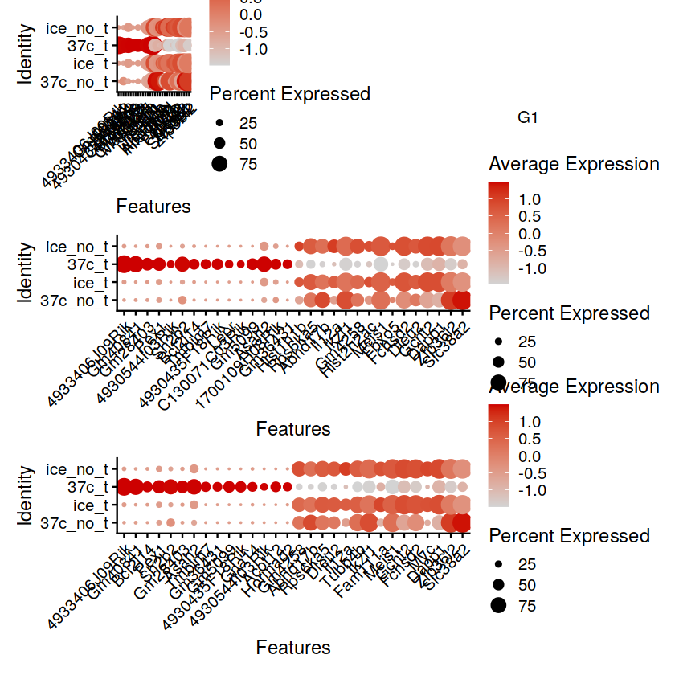

``` r
ggsave(plot, filename = "plots/1.svg", device = "svg", units = "in", width = 12, height = 12)
```

``` r
one_dot_plot <- \(comparison = "37c_t", n_genes = 15, phase = "S") {
    feats <- c(
        degs[[comparison]][[phase]] %>% head(., n = n_genes) %>% rownames,
        degs[[comparison]][[phase]] %>% tail(., n = n_genes) %>% rownames
    )
    plot <- DotPlot(sobj, features = feats, cols = cols_features) +
        theme(
            axis.text.x = element_text(angle = 45, vjust = 1, hjust=1)
        ) +
        labs(
            # title = str_c("Comparison ", comparison, ":"),
            subtitle = str_c("Cell cycle phase ", phase, ":"),
            y = "",
            x = ""
            # y = "Condition",
            # x = "DEGs"
        )
    return(plot)
}
one_dot_plot()
```

    Warning message:
    “Scaling data with a low number of groups may produce misleading results”

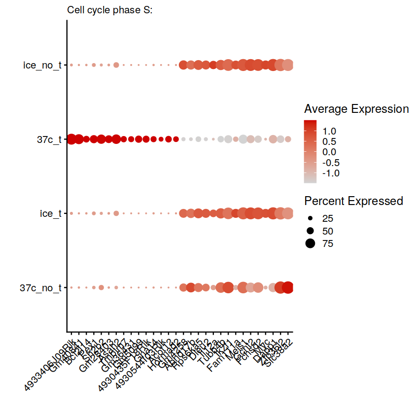

``` r
comp <- "37c_t"
n_genes <- 15
plot <- one_dot_plot(comparison = comp, phase = "G1") /
one_dot_plot(comparison = comp, phase = "G2M") /
one_dot_plot(comparison = comp, phase = "S") + plot_annotation(
  title = str_c(
    "DEGs between ",
    comparisons[[comp]][[1]],
    " and ",
    "(", str_flatten(comparisons[[comp]][[2]], " + "), ")"
  ),
  subtitle = "",
  caption = str_c(
    "The top ", n_genes, " DEGs for ", comp[[1]],
    " and the top ", n_genes, " DEGs for ", 
    str_flatten(comparisons[[comp]][[2]], " + ")
  )
)
plot
```

    Warning message:
    “Scaling data with a low number of groups may produce misleading results”
    Warning message:
    “Scaling data with a low number of groups may produce misleading results”
    Warning message:
    “Scaling data with a low number of groups may produce misleading results”

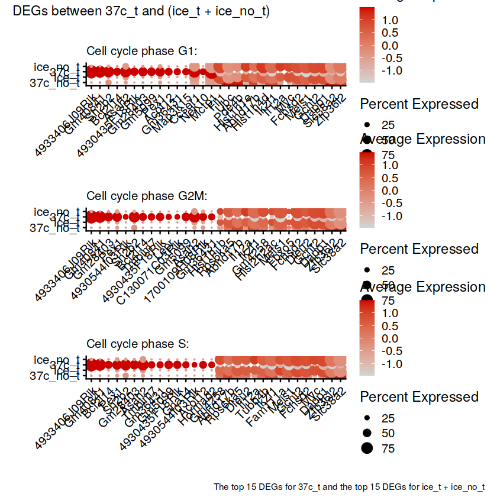

``` r
ggsave(plot, filename = "plots/1.svg", device = "svg", units = "in", width = 12, height = 12)
```

``` r
all_phases_dot_plot <- \(comparison = "37c_t", n_genes = 15) {
  plot <- one_dot_plot(comparison = comparison, phase = "G1") /
  one_dot_plot(comparison = comparison, phase = "G2M") /
  one_dot_plot(comparison = comparison, phase = "S") + plot_annotation(
    title = str_c(
      "DEGs between ",
      comparisons[[comparison]][[1]],
      " and ",
      str_flatten(comparisons[[comparison]][[2]], " + ")
    ),
    subtitle = "Cell cycle phase-wise",
    caption = str_c(
      "The top ", n_genes, " DEGs for ", comparisons[[comparison]][[1]],
      " (left) and the top ", n_genes, " DEGs for ", 
      str_flatten(comparisons[[comparison]][[2]], " + "),
      " (right)"
    )
  )
  plot %>% return
}
all_phases_dot_plot()
```

    Warning message:
    “Scaling data with a low number of groups may produce misleading results”
    Warning message:
    “Scaling data with a low number of groups may produce misleading results”
    Warning message:
    “Scaling data with a low number of groups may produce misleading results”

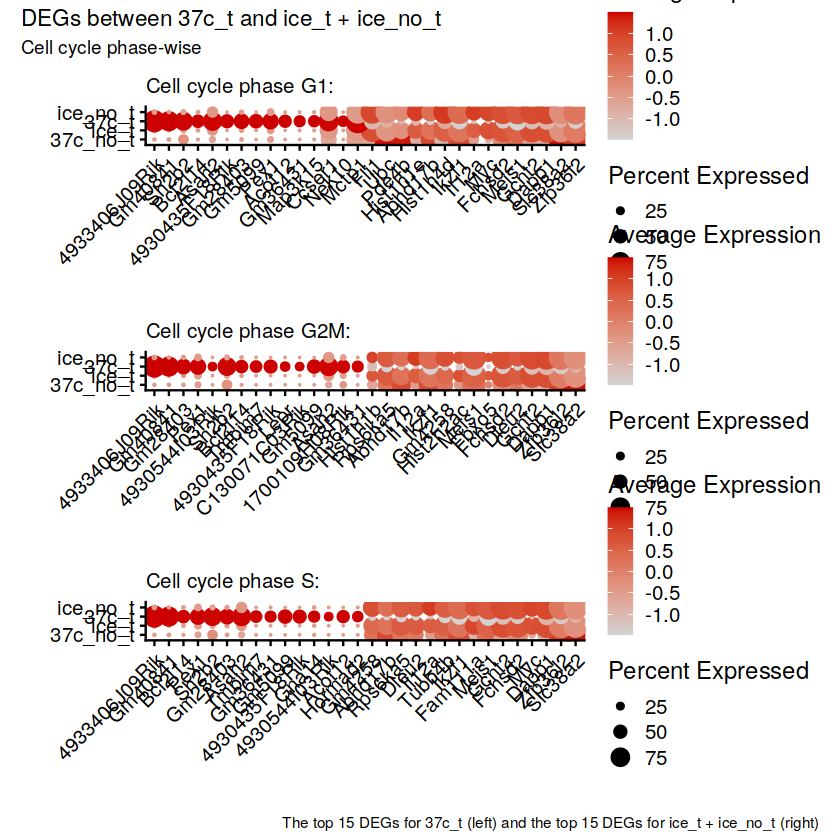

------------------------------------------------------------------------

# Collated dot plots

``` r
plot <- all_phases_dot_plot(comparison = "37c_t")
plot
ggsave(plot, filename = "plots/37c_t.svg", device = "svg", units = "in", width = 12, height = 12)
```

    Warning message:
    “Scaling data with a low number of groups may produce misleading results”
    Warning message:
    “Scaling data with a low number of groups may produce misleading results”
    Warning message:
    “Scaling data with a low number of groups may produce misleading results”


``` r
plot <- all_phases_dot_plot(comparison = "37c_no_t")
plot
ggsave(plot, filename = "plots/37c_no_t.svg", device = "svg", units = "in", width = 12, height = 12)
```

    Warning message:
    “Scaling data with a low number of groups may produce misleading results”
    Warning message:
    “Scaling data with a low number of groups may produce misleading results”
    Warning message:
    “Scaling data with a low number of groups may produce misleading results”

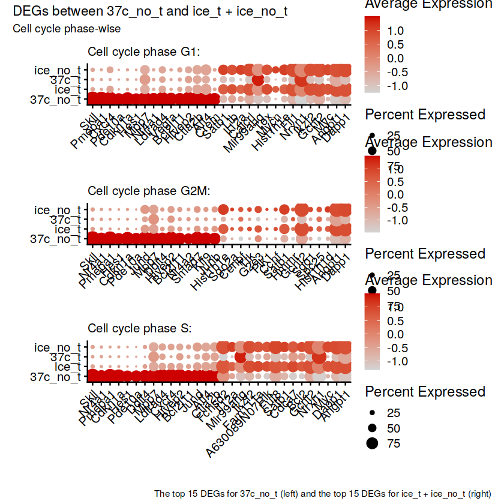

``` r
plot <- all_phases_dot_plot(comparison = "37c_t_vs_no_t")
plot
ggsave(plot, filename = "plots/37c_t_vs_no_t.svg", device = "svg", units = "in", width = 12, height = 12)
```

    Warning message:
    “Scaling data with a low number of groups may produce misleading results”
    Warning message:
    “Scaling data with a low number of groups may produce misleading results”
    Warning message:
    “Scaling data with a low number of groups may produce misleading results”

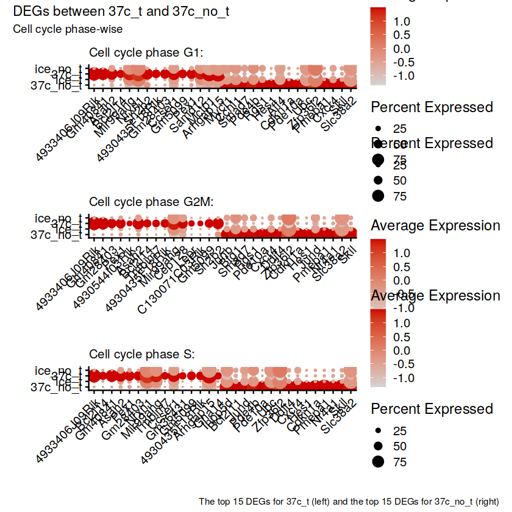

## Dot plots overlapping DEGs

``` r
one_dot_plot_overlaps <- \(comparison = "37c_t", n_genes = 15) {
    feats <- c(
        overlaps[[comparison]] %>% head(., n = n_genes) %>% rownames,
        overlaps[[comparison]] %>% tail(., n = n_genes) %>% rownames
    )
    plot <- DotPlot(sobj, features = feats, cols = cols_features) +
        theme(
            axis.text.x = element_text(angle = 45, vjust = 1, hjust=1)
        ) +
        labs(
            title = str_c(
                "DEGs between ",
                comparisons[[comparison]][[1]],
                " and ",
                str_flatten(comparisons[[comparison]][[2]], " + ")
            ),
            subtitle = str_c(
                "Overlaps/intersection between cell cycle phase-wise DEG analyses"
            ),
            caption = str_c(
                "The top ", n_genes, " DEGs for ", comparisons[[comparison]][[1]],
                " (left) and the top ", n_genes, " DEGs for ", 
                str_flatten(comparisons[[comparison]][[2]], " + "),
                " (right)"
            ),
            y = "Condition",
            x = "DEGs"
        )
    return(plot)
}
one_dot_plot_overlaps()
```

    Warning message:
    “Scaling data with a low number of groups may produce misleading results”

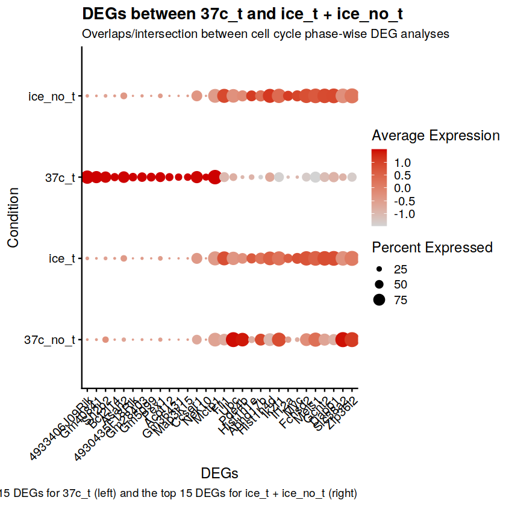

``` r
names(comparisons)
```

1.  ‘37c_t’
2.  ‘37c_no_t’
3.  ‘37c_t_vs_no_t’

``` r
one_dot_plot_overlaps("37c_t")
one_dot_plot_overlaps("37c_t_vs_no_t")
one_dot_plot_overlaps("37c_no_t")
```

    Warning message:
    “Scaling data with a low number of groups may produce misleading results”
    Warning message:
    “Scaling data with a low number of groups may produce misleading results”
    Warning message:
    “Scaling data with a low number of groups may produce misleading results”


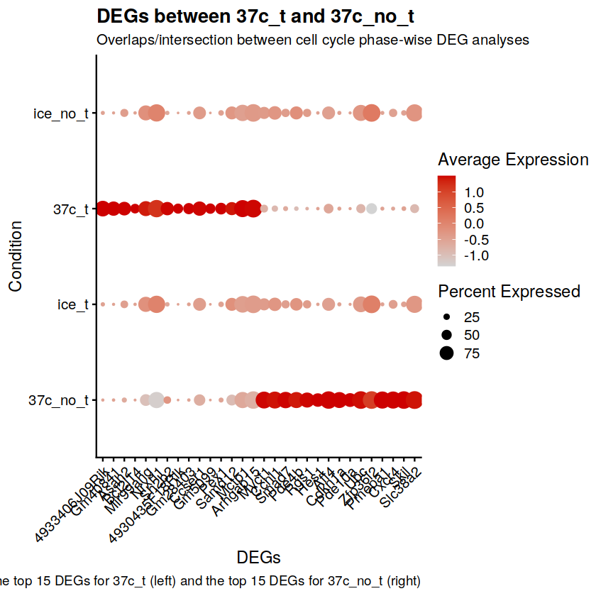

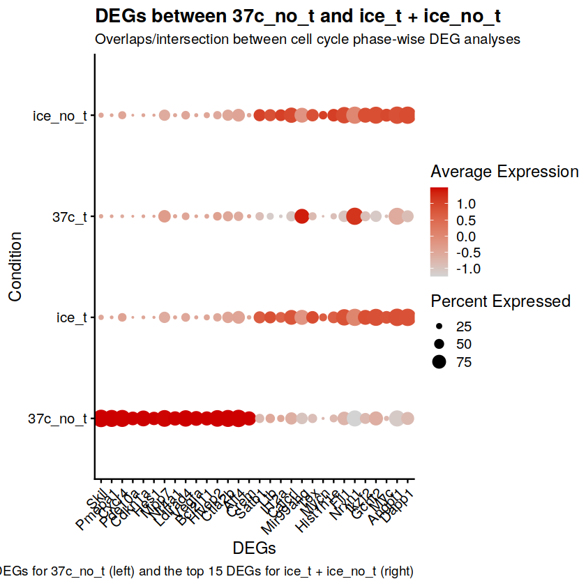

``` r
lapply(names(overlaps), FUN = \(comp) {
    ggsave(
        one_dot_plot_overlaps(comparison = comp),
        filename = str_c("plots/", "deg_overlap_", comp, ".svg"),
        device = "svg", units = "in", width = 12, height = 5
    )
})
```

    Warning message:
    “Scaling data with a low number of groups may produce misleading results”
    Warning message:
    “Scaling data with a low number of groups may produce misleading results”
    Warning message:
    “Scaling data with a low number of groups may produce misleading results”

1.  ‘plots/deg_overlap_37c_t.svg’
2.  ‘plots/deg_overlap_37c_no_t.svg’
3.  ‘plots/deg_overlap_37c_t_vs_no_t.svg’

------------------------------------------------------------------------

# QC plots

``` r
sobj[[]] %>% colnames
```

1.  ‘orig.ident’
2.  ‘nCount_RNA’
3.  ‘nFeature_RNA’
4.  ‘nCount_ADT’
5.  ‘nFeature_ADT’
6.  ‘nCount_HTO’
7.  ‘nFeature_HTO’
8.  ‘percent.mt’
9.  ‘hto’
10. ‘sample’
11. ‘sample_longname’
12. ‘buffer_treatment’
13. ‘incubation_method’
14. ‘S.Score’
15. ‘G2M.Score’
16. ‘Phase’
17. ‘old.ident’
18. ‘RNA_snn_res.0.8’
19. ‘seurat_clusters’
20. ‘stress_signature1’
21. ‘is_stressed’

``` r
feats_of_interest <- list(
  "nCount_RNA", "nFeature_RNA", "nCount_ADT", "nCount_HTO", "percent.mt", "stress_signature1"
)
feats_of_interest
```

1.  ‘nCount_RNA’
2.  ‘nFeature_RNA’
3.  ‘nCount_ADT’
4.  ‘nCount_HTO’
5.  ‘percent.mt’
6.  ‘stress_signature1’

``` r
qc_plot <- \(feat = "nCount_RNA") {
    VlnPlot(sobj, features = feat) +
        scale_fill_viridis(discrete = T, option = "plasma")
}
qc_plot()
```

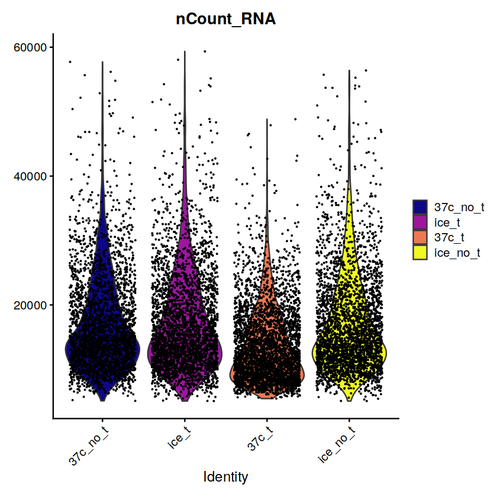

``` r
plots <- lapply(feats_of_interest, qc_plot)
```

``` r
names(plots) <- feats_of_interest
```

``` r
lapply(feats_of_interest, FUN = \(feat) ggsave(plots[[feat]],
    filename = str_c("plots/qc_", feat, ".svg"),
    device = "svg",
    units = "in",
    width = 6,
    height = 6)
)
```

1.  ‘plots/qc_nCount_RNA.svg’
2.  ‘plots/qc_nFeature_RNA.svg’
3.  ‘plots/qc_nCount_ADT.svg’
4.  ‘plots/qc_nCount_HTO.svg’
5.  ‘plots/qc_percent.mt.svg’
6.  ‘plots/qc_stress_signature1.svg’

``` r
plots
```

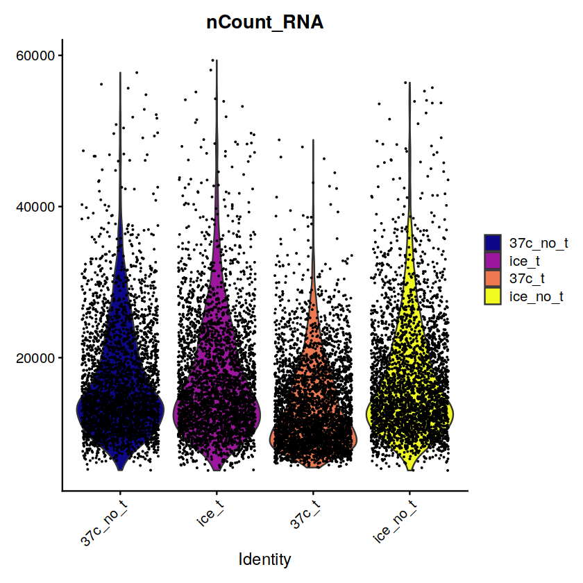

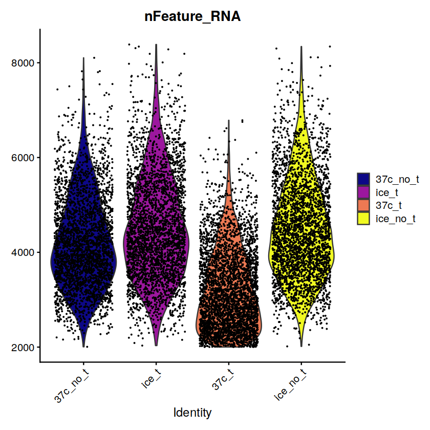

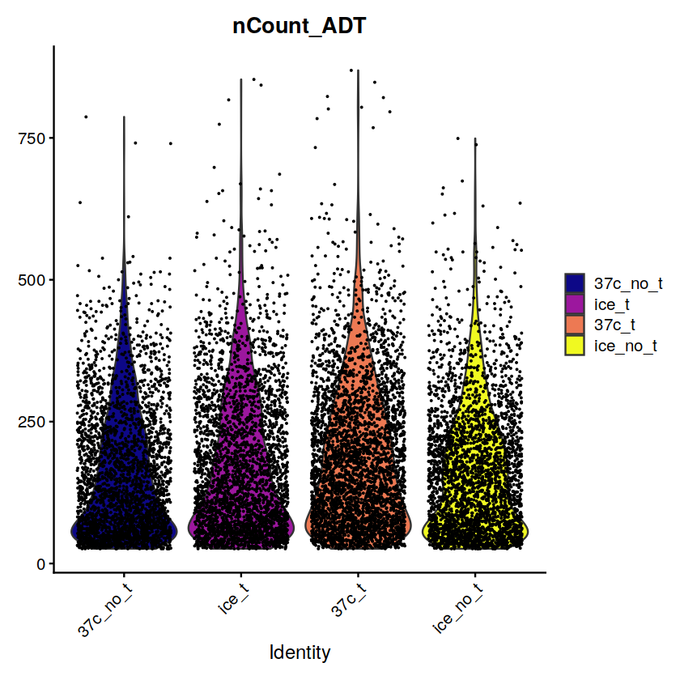

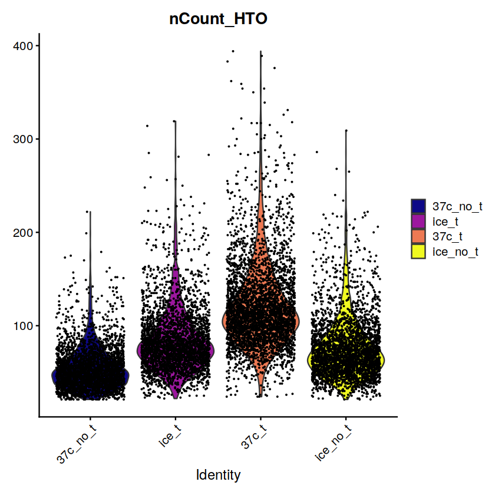

    $nCount_RNA

    $nFeature_RNA

    $nCount_ADT

    $nCount_HTO

    $percent.mt

    $stress_signature1

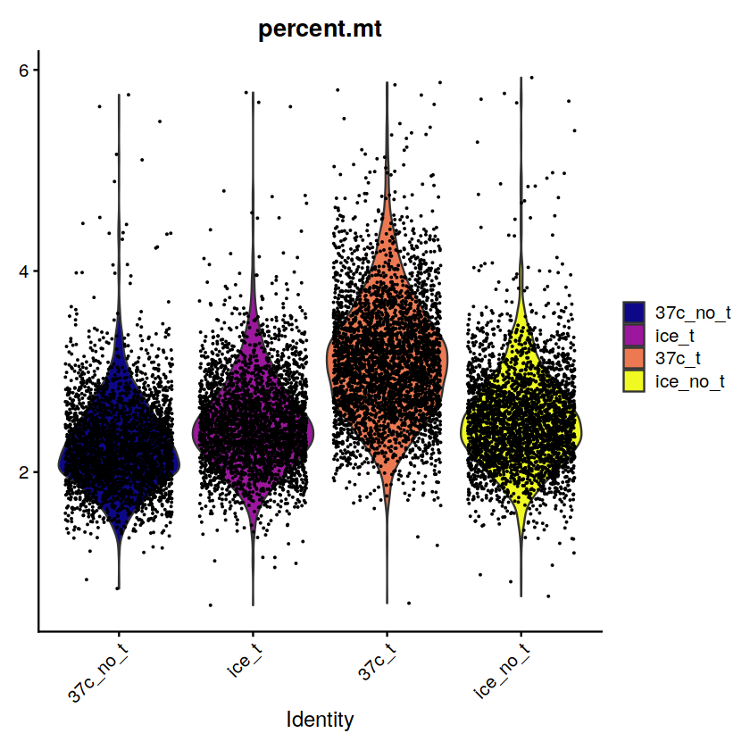

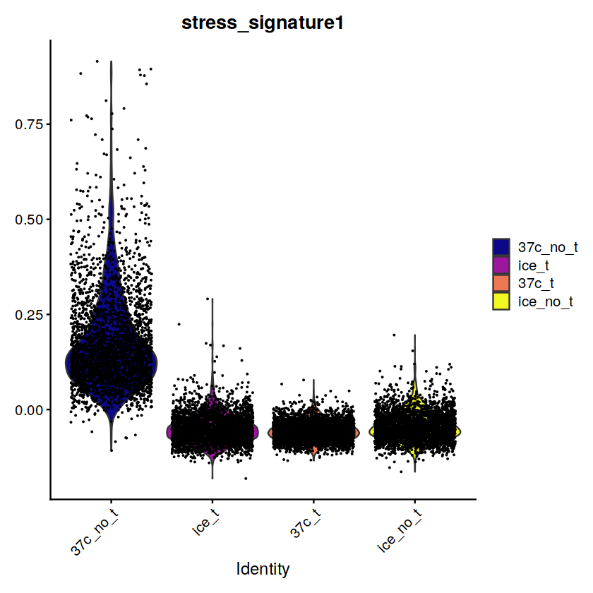

------------------------------------------------------------------------

# Signatures

``` r
signature_file <- "../data/raw/Genesets.gmx.txt"
```

``` r
dirname(signature_file) %>% dir
```

1.  ‘Annas - Stress GEX analysis’
2.  ‘cellranger-GRCh38-mm10’
3.  ‘cellranger-mm10’
4.  ‘Genesets.gmx.txt’
5.  ‘HTO-fastqs’
6.  ‘md5sum.txt’
7.  ‘RNA-fastqs’
8.  ‘stress_signature.tsv’

``` r
sigs_dirty <- read.delim(signature_file)
sigs_dirty %>% head
```

A data.frame: 6 × 4

<table>
<colgroup>
<col style="width: 20%" />
<col style="width: 20%" />
<col style="width: 20%" />
<col style="width: 20%" />
<col style="width: 20%" />
</colgroup>
<thead>
<tr class="header">
<th><!--/--></th>
<th>Stress.induced.in.HSCs &lt;chr&gt;</th>
<th>Aged.HSC.genes_Flohr.Svendsen.et.al &lt;chr&gt;</th>
<th>Young.HSC.genes_Flohr.Svendsen.et.al &lt;chr&gt;</th>
<th>Cell.cycle.in.HSCs &lt;chr&gt;</th>
</tr>
</thead>
<tbody>
<tr class="odd">
<td>1</td>
<td>na</td>
<td>na</td>
<td>na</td>
<td>na</td>
</tr>
<tr class="even">
<td>2</td>
<td>Egr2</td>
<td>Ntf3</td>
<td>Lsp1</td>
<td>Rpa2</td>
</tr>
<tr class="odd">
<td>3</td>
<td>Atf3</td>
<td>Mab21l2</td>
<td>Slc28a2</td>
<td>Hspa8</td>
</tr>
<tr class="even">
<td>4</td>
<td>Klf2</td>
<td>Sbspon</td>
<td>Rfc2</td>
<td>Dtymk</td>
</tr>
<tr class="odd">
<td>5</td>
<td>Nr4a1</td>
<td>Osmr</td>
<td>Ctss</td>
<td>Sqle</td>
</tr>
<tr class="even">
<td>6</td>
<td>Ptgs2</td>
<td>Cntn1</td>
<td>Mlec</td>
<td>Mcm5</td>
</tr>
</tbody>
</table>

``` r
sigs <- list()
```

``` r
sigs[["cc"]] <- sigs_dirty[[colnames(sigs_dirty)[
    str_detect("cycle", string = colnames(sigs_dirty))]
]]
sigs[["young"]] <- sigs_dirty[[colnames(sigs_dirty)[
    str_detect("Young", string = colnames(sigs_dirty))]
]]
sigs[["aged"]] <- sigs_dirty[[colnames(sigs_dirty)[
    str_detect("Aged", string = colnames(sigs_dirty))]
]]
sigs[["stress"]] <- sigs_dirty[[colnames(sigs_dirty)[
    str_detect("Stress", string = colnames(sigs_dirty))]
]]
sigs
```

$cc  
1.  ‘na’
2.  ‘Rpa2’
3.  ‘Hspa8’
4.  ‘Dtymk’
5.  ‘Sqle’
6.  ‘Mcm5’
7.  ‘Stmn1’
8.  ‘Dmd’
9.  ‘Prmt5’
10. ‘Bcl3’
11. ‘Nasp’
12. ‘Ss18’
13. ‘Mcm3’
14. ‘Orc6’
15. ‘Sfpq’
16. ‘Mybl2’
17. ‘Orc5’
18. ‘Wrn’
19. ‘Pttg1’
20. ‘Ythdc1’
21. ‘Smad3’
22. ‘Mapk14’
23. ‘Amd1’
24. ‘Map3k20’
25. ‘Bub3’
26. ‘Hnrnpd’
27. ‘Kpnb1’
28. ‘Ube2s’
29. ‘Cks1b’
30. ‘Srsf1’
31. ‘E2f4’
32. ‘Ddx39a’
33. ‘Traip’
34. ‘Lbr’
35. ‘H2az2’
36. ‘Polq’
37. ‘Dkc1’
38. ‘Arid4a’
39. ‘Rps6ka5’
40. ‘Cdc7’
41. ‘Slc7a1’
42. ‘Pola2’
43. ‘Prpf4b’
44. ‘H2az1’
45. ‘Abl1’
46. ‘Pafah1b1’
47. ‘Lmnb1’
48. ‘Jpt1’
49. ‘Gspt1’
50. ‘Odf2’
51. ‘Foxn3’
52. ‘Troap’
53. ‘Hus1’
54. ‘Ctcf’
55. ‘Numa1’
56. ‘Cdc27’
57. ‘Top1’
58. ‘Prim2’
59. ‘Pml’
60. ‘Pds5b’
61. ‘Kif5b’
62. ‘Nup50’
63. ‘Xpo1’
64. ‘Notch2’
65. ‘Atrx’
66. ‘Nsd2’
67. ‘Rad21’
68. ‘Tle3’
69. ‘Ezh2’
70. ‘Nup98’
71. ‘Stag1’
72. ‘Tent4a’
73. ‘Cdc25a’
74. ‘Smc1a’
75. ‘Rbl1’
76. ‘Lig3’
77. ‘Tmpo’
78. ‘E2f3’
79. ‘Slc38a1’
80. ‘Rad54l’
81. ‘Suv39h1’
82. ‘Mtf2’
83. ‘Egf’
84. ‘Pura’
85. ‘Rasal2’
86. ‘Mad2l1’
87. ‘Pole’
88. ‘Ccnt1’
89. ‘Smarcc1’
90. ‘Cdkn2c’
91. ‘Cdc25b’
92. ‘Brca2’
93. ‘Exo1’
94. ‘Hira’
95. ‘Dbf4’
96. ‘Cks2’
97. ‘Cdc45’
98. ‘Smc2’
99. ‘Smc4’
100. ‘Pbk’
101. ‘H2ax’
102. ‘Cdc20’
103. ‘Plk4’
104. ‘Ndc80’
105. ‘Tacc3’
106. ‘Cenpa’
107. ‘Kif22’
108. ‘Incenp’
109. ‘Stil’
110. ‘Kif23’
111. ‘Knl1’
112. ‘Racgap1’
113. ‘Top2a’
114. ‘Fbxo5’
115. ‘Cdk1’
116. ‘Ccnf’
117. ‘Ccnb2’
118. ‘Ttk’
119. ‘Aurka’
120. ‘Kif20b’
121. ‘Cdkn3’
122. ‘Mki67’
123. ‘Plk1’
124. ‘Ccna2’
125. ‘Tpx2’
126. ‘Aurkb’
127. ‘Birc5’
128. ‘Nusap1’
129. ‘Kif4’
130. ‘Hmmr’
131. ‘Nek2’
132. ‘Espl1’
133. ‘Bub1’
134. ‘Cenpe’
135. ‘Kif11’
136. ‘Prc1’
137. ‘Kif2c’
138. ‘Cenpf’
139. ‘Ube2c’
140. ’’
141. ’’
142. ’’
143. ’’
144. ’’
145. ’’
146. ’’
147. ’’
148. ’’
149. ’’
150. ’’
151. ’’
152. ’’
153. ’’
154. ’’
155. ’’
156. ’’
157. ’’
158. ’’
159. ’’
160. ’’
161. ’’
162. ’’
163. ’’
164. ’’
165. ’’
166. ’’
167. ’’
168. ’’
169. ’’
170. ’’
171. ’’
172. ’’
173. ’’
174. ’’
175. ’’
176. ’’
177. ’’
178. ’’
179. ’’
180. ’’
181. ’’
182. ’’

$young  
1.  ‘na’
2.  ‘Lsp1’
3.  ‘Slc28a2’
4.  ‘Rfc2’
5.  ‘Ctss’
6.  ‘Mlec’
7.  ‘Il15’
8.  ‘Anxa2’
9.  ‘Syk’
10. ‘Ect2’
11. ‘Mcm5’
12. ‘Antxr2’
13. ‘Mamdc2’
14. ‘Cd34’
15. ‘Arhgap30’
16. ‘Lst1’
17. ‘Mgst1’
18. ‘Col4a2’
19. ‘Tm6sf1’
20. ‘Ebi3’
21. ‘Dnmt3b’
22. ‘Cd37’
23. ‘Plxdc2’
24. ‘Rnase6’
25. ‘Flt3’
26. ‘Sell’
27. ‘Rassf4’
28. ‘Csf2rb’
29. ‘Mcm7’
30. ‘Plac8’
31. ‘Cd86’
32. ‘Hnf4a’
33. ‘Socs2’
34. ‘Il12rb2’
35. ‘Satb1’
36. ‘Nrk’
37. ‘Camk1d’
38. ‘Lgals1’
39. ‘Anxa6’
40. ‘Mmp2’
41. ’’
42. ’’
43. ’’
44. ’’
45. ’’
46. ’’
47. ’’
48. ’’
49. ’’
50. ’’
51. ’’
52. ’’
53. ’’
54. ’’
55. ’’
56. ’’
57. ’’
58. ’’
59. ’’
60. ’’
61. ’’
62. ’’
63. ’’
64. ’’
65. ’’
66. ’’
67. ’’
68. ’’
69. ’’
70. ’’
71. ’’
72. ’’
73. ’’
74. ’’
75. ’’
76. ’’
77. ’’
78. ’’
79. ’’
80. ’’
81. ’’
82. ’’
83. ’’
84. ’’
85. ’’
86. ’’
87. ’’
88. ’’
89. ’’
90. ’’
91. ’’
92. ’’
93. ’’
94. ’’
95. ’’
96. ’’
97. ’’
98. ’’
99. ’’
100. ’’
101. ’’
102. ’’
103. ’’
104. ’’
105. ’’
106. ’’
107. ’’
108. ’’
109. ’’
110. ’’
111. ’’
112. ’’
113. ’’
114. ’’
115. ’’
116. ’’
117. ’’
118. ’’
119. ’’
120. ’’
121. ’’
122. ’’
123. ’’
124. ’’
125. ’’
126. ’’
127. ’’
128. ’’
129. ’’
130. ’’
131. ’’
132. ’’
133. ’’
134. ’’
135. ’’
136. ’’
137. ’’
138. ’’
139. ’’
140. ’’
141. ’’
142. ’’
143. ’’
144. ’’
145. ’’
146. ’’
147. ’’
148. ’’
149. ’’
150. ’’
151. ’’
152. ’’
153. ’’
154. ’’
155. ’’
156. ’’
157. ’’
158. ’’
159. ’’
160. ’’
161. ’’
162. ’’
163. ’’
164. ’’
165. ’’
166. ’’
167. ’’
168. ’’
169. ’’
170. ’’
171. ’’
172. ’’
173. ’’
174. ’’
175. ’’
176. ’’
177. ’’
178. ’’
179. ’’
180. ’’
181. ’’
182. ’’

$aged  
1.  ‘na’
2.  ‘Ntf3’
3.  ‘Mab21l2’
4.  ‘Sbspon’
5.  ‘Osmr’
6.  ‘Cntn1’
7.  ‘Gabra4’
8.  ‘Gipc2’
9.  ‘Clu’
10. ‘Rbpjl’
11. ‘Zg16’
12. ‘Selp’
13. ‘Tdrd9’
14. ‘Mt2’
15. ‘Lrrn1’
16. ‘Clca3a1’
17. ‘Plscr2’
18. ‘Tc2n’
19. ‘Matn4’
20. ‘Fap’
21. ‘Muc1’
22. ‘Ramp2’
23. ‘Tmem215’
24. ‘Trpc1’
25. ‘Chrna7’
26. ‘Rgn’
27. ‘Rorb’
28. ‘Tm4sf1’
29. ‘Wwtr1’
30. ‘Gpr183’
31. ‘Zswim5’
32. ‘C4b’
33. ‘Nupr1’
34. ‘Gstm2’
35. ‘Bmpr1a’
36. ‘Tmem47’
37. ‘Gda’
38. ‘Sult1a1’
39. ‘Tmem56’
40. ‘Mt1’
41. ‘Aspa’
42. ‘Cyb561’
43. ‘Neo1’
44. ‘Adgrg2’
45. ‘Pclo’
46. ‘Gm10419’
47. ‘Klrb1c’
48. ‘Jam2’
49. ‘Maf’
50. ‘Dsg2’
51. ‘Perp’
52. ‘Lpl’
53. ‘Pgr’
54. ‘Ddr1’
55. ‘Clec1a’
56. ‘Dnm3’
57. ‘B3galt1’
58. ‘Meis2’
59. ‘Ptprk’
60. ‘Ehd3’
61. ‘Aldh1a1’
62. ‘Cavin2’
63. ‘Phf11d’
64. ‘Abat’
65. ‘Runx1t1’
66. ‘Amotl2’
67. ‘Acpp’
68. ‘Cd200r4’
69. ‘Kdr’
70. ‘Alcam’
71. ‘Asb4’
72. ‘Cd38’
73. ‘Klhl4’
74. ‘Enpp5’
75. ‘Il1rapl2’
76. ‘Gadd45g’
77. ‘Sfrp1’
78. ‘Zfp36’
79. ‘Nrg4’
80. ‘Cpne8’
81. ‘Fhdc1’
82. ‘Cysltr2’
83. ‘Plcl1’
84. ‘Abca4’
85. ‘Clec1b’
86. ‘Vldlr’
87. ‘Pcdhb16’
88. ‘Hpgds’
89. ‘Abcb1a’
90. ‘Vwf’
91. ‘Ghr’
92. ‘Slc6a15’
93. ‘Mmp14’
94. ‘Klrb1b’
95. ‘Id2’
96. ‘Zfp334’
97. ‘Gem’
98. ‘Ocln’
99. ‘Plek’
100. ‘Ptger4’
101. ‘Thbd’
102. ‘Ldhd’
103. ‘Itgb3’
104. ‘S100a6’
105. ‘Dhrs3’
106. ‘Rhoj’
107. ‘Rdh10’
108. ‘Fhl1’
109. ‘Oxr1’
110. ‘Rorc’
111. ‘Rab34’
112. ‘Cyyr1’
113. ‘Myo1e’
114. ‘Stxbp4’
115. ‘Dennd5b’
116. ‘Ampd3’
117. ‘Stom’
118. ‘Lsr’
119. ‘Cyp26b1’
120. ‘Plscr1’
121. ‘Casp12’
122. ‘Mllt3’
123. ‘Pbx3’
124. ‘Tacstd2’
125. ‘Bcl6’
126. ‘Pdgfd’
127. ‘Egr1’
128. ‘Cytip’
129. ‘Ndrg1’
130. ‘Cd9’
131. ‘Tox’
132. ‘Efna1’
133. ‘Vmp1’
134. ‘Trim47’
135. ‘Tgm2’
136. ‘Arhgap29’
137. ‘Serpinb8’
138. ‘Prcp’
139. ‘Pros1’
140. ‘Prtn3’
141. ‘Nckap1’
142. ‘Phactr1’
143. ‘Tbc1d8’
144. ‘Arhgef28’
145. ‘Slc14a1’
146. ‘Lamp2’
147. ‘Acsl4’
148. ‘Cxcl16’
149. ‘Gpx3’
150. ‘Dhx40’
151. ‘Sema7a’
152. ‘Slamf1’
153. ‘Art4’
154. ‘Jun’
155. ‘Serpinb6a’
156. ‘Fyb’
157. ‘Evc’
158. ‘Kcnip3’
159. ‘Mef2c’
160. ‘Abcb1b’
161. ‘Lpar6’
162. ‘Prnp’
163. ‘Exoc6b’
164. ‘Pla2g4a’
165. ‘Ndn’
166. ‘Npdc1’
167. ‘Plscr4’
168. ‘Tnfsf10’
169. ‘Nt5c3’
170. ‘Ppp1r16b’
171. ‘Gstm1’
172. ‘Gstm7’
173. ‘Mmrn1’
174. ‘Cldn12’
175. ‘Procr’
176. ‘Muc13’
177. ‘Tmem176a’
178. ‘Trpc6’
179. ‘Ly6e’
180. ‘Btg2’
181. ‘Cd63’
182. ‘Tsc22d1’

$stress  
1.  ‘na’
2.  ‘Egr2’
3.  ‘Atf3’
4.  ‘Klf2’
5.  ‘Nr4a1’
6.  ‘Ptgs2’
7.  ‘Klf4’
8.  ‘Fosb’
9.  ‘Btg2’
10. ‘Junb’
11. ‘Nr4a2’
12. ‘Zfp36’
13. ‘Cxcl2’
14. ‘Jun’
15. ‘Klf6’
16. ‘Ccn1’
17. ‘Rhob’
18. ‘Socs3’
19. ‘Ier2’
20. ‘Dusp1’
21. ‘Egr1’
22. ‘Cdkn1a’
23. ‘Ppp1r15a’
24. ‘Phlda1’
25. ‘Maff’
26. ‘Cd69’
27. ‘Dusp5’
28. ‘Hes1’
29. ‘Cebpb’
30. ‘Ier5’
31. ‘Plk2’
32. ‘Gem’
33. ‘Tiparp’
34. ‘Gadd45b’
35. ‘Sgk1’
36. ‘Egr3’
37. ‘Ier3’
38. ‘Dusp2’
39. ‘Per1’
40. ‘Hbegf’
41. ‘Trib1’
42. ‘Lif’
43. ‘Tnfaip3’
44. ‘Fos’
45. ‘Cxcl10’
46. ‘Ccrl2’
47. ‘Il7r’
48. ‘Gadd45a’
49. ‘Plek’
50. ‘Fjx1’
51. ‘Zc3h12a’
52. ‘Bhlhe40’
53. ‘Fosl1’
54. ‘Ccnl1’
55. ‘Btg1’
56. ‘Eif1’
57. ‘Mcl1’
58. ‘Plaur’
59. ‘Sdc4’
60. ‘Areg’
61. ‘Vegfa’
62. ‘Rnf19b’
63. ‘Cxcl5’
64. ‘Panx1’
65. ‘Tnf’
66. ‘Sat1’
67. ‘Phlda2’
68. ‘Gfpt2’
69. ‘Id2’
70. ‘Il1b’
71. ‘Gpr183’
72. ‘Pfkfb3’
73. ‘Spsb1’
74. ‘Plau’
75. ‘Cd83’
76. ‘Ripk2’
77. ‘Btg3’
78. ‘Csf1’
79. ‘Tnfrsf9’
80. ’’
81. ’’
82. ’’
83. ’’
84. ’’
85. ’’
86. ’’
87. ’’
88. ’’
89. ’’
90. ’’
91. ’’
92. ’’
93. ’’
94. ’’
95. ’’
96. ’’
97. ’’
98. ’’
99. ’’
100. ’’
101. ’’
102. ’’
103. ’’
104. ’’
105. ’’
106. ’’
107. ’’
108. ’’
109. ’’
110. ’’
111. ’’
112. ’’
113. ’’
114. ’’
115. ’’
116. ’’
117. ’’
118. ’’
119. ’’
120. ’’
121. ’’
122. ’’
123. ’’
124. ’’
125. ’’
126. ’’
127. ’’
128. ’’
129. ’’
130. ’’
131. ’’
132. ’’
133. ’’
134. ’’
135. ’’
136. ’’
137. ’’
138. ’’
139. ’’
140. ’’
141. ’’
142. ’’
143. ’’
144. ’’
145. ’’
146. ’’
147. ’’
148. ’’
149. ’’
150. ’’
151. ’’
152. ’’
153. ’’
154. ’’
155. ’’
156. ’’
157. ’’
158. ’’
159. ’’
160. ’’
161. ’’
162. ’’
163. ’’
164. ’’
165. ’’
166. ’’
167. ’’
168. ’’
169. ’’
170. ’’
171. ’’
172. ’’
173. ’’
174. ’’
175. ’’
176. ’’
177. ’’
178. ’’
179. ’’
180. ’’
181. ’’
182. ’’

``` r
saved_names <- names(sigs)
sigs <- lapply(sigs, FUN = \(s) s[s %>% str_length > 0 & s != "na"])
# sigs <- lapply(names(sigs), FUN = \(s) sigs[[s]][sigs[[s]] %>% str_length > 0 & sigs[[s]] != "na"])
# names(sigs) <- saved_names
sigs
```

$cc  
1.  ‘Rpa2’
2.  ‘Hspa8’
3.  ‘Dtymk’
4.  ‘Sqle’
5.  ‘Mcm5’
6.  ‘Stmn1’
7.  ‘Dmd’
8.  ‘Prmt5’
9.  ‘Bcl3’
10. ‘Nasp’
11. ‘Ss18’
12. ‘Mcm3’
13. ‘Orc6’
14. ‘Sfpq’
15. ‘Mybl2’
16. ‘Orc5’
17. ‘Wrn’
18. ‘Pttg1’
19. ‘Ythdc1’
20. ‘Smad3’
21. ‘Mapk14’
22. ‘Amd1’
23. ‘Map3k20’
24. ‘Bub3’
25. ‘Hnrnpd’
26. ‘Kpnb1’
27. ‘Ube2s’
28. ‘Cks1b’
29. ‘Srsf1’
30. ‘E2f4’
31. ‘Ddx39a’
32. ‘Traip’
33. ‘Lbr’
34. ‘H2az2’
35. ‘Polq’
36. ‘Dkc1’
37. ‘Arid4a’
38. ‘Rps6ka5’
39. ‘Cdc7’
40. ‘Slc7a1’
41. ‘Pola2’
42. ‘Prpf4b’
43. ‘H2az1’
44. ‘Abl1’
45. ‘Pafah1b1’
46. ‘Lmnb1’
47. ‘Jpt1’
48. ‘Gspt1’
49. ‘Odf2’
50. ‘Foxn3’
51. ‘Troap’
52. ‘Hus1’
53. ‘Ctcf’
54. ‘Numa1’
55. ‘Cdc27’
56. ‘Top1’
57. ‘Prim2’
58. ‘Pml’
59. ‘Pds5b’
60. ‘Kif5b’
61. ‘Nup50’
62. ‘Xpo1’
63. ‘Notch2’
64. ‘Atrx’
65. ‘Nsd2’
66. ‘Rad21’
67. ‘Tle3’
68. ‘Ezh2’
69. ‘Nup98’
70. ‘Stag1’
71. ‘Tent4a’
72. ‘Cdc25a’
73. ‘Smc1a’
74. ‘Rbl1’
75. ‘Lig3’
76. ‘Tmpo’
77. ‘E2f3’
78. ‘Slc38a1’
79. ‘Rad54l’
80. ‘Suv39h1’
81. ‘Mtf2’
82. ‘Egf’
83. ‘Pura’
84. ‘Rasal2’
85. ‘Mad2l1’
86. ‘Pole’
87. ‘Ccnt1’
88. ‘Smarcc1’
89. ‘Cdkn2c’
90. ‘Cdc25b’
91. ‘Brca2’
92. ‘Exo1’
93. ‘Hira’
94. ‘Dbf4’
95. ‘Cks2’
96. ‘Cdc45’
97. ‘Smc2’
98. ‘Smc4’
99. ‘Pbk’
100. ‘H2ax’
101. ‘Cdc20’
102. ‘Plk4’
103. ‘Ndc80’
104. ‘Tacc3’
105. ‘Cenpa’
106. ‘Kif22’
107. ‘Incenp’
108. ‘Stil’
109. ‘Kif23’
110. ‘Knl1’
111. ‘Racgap1’
112. ‘Top2a’
113. ‘Fbxo5’
114. ‘Cdk1’
115. ‘Ccnf’
116. ‘Ccnb2’
117. ‘Ttk’
118. ‘Aurka’
119. ‘Kif20b’
120. ‘Cdkn3’
121. ‘Mki67’
122. ‘Plk1’
123. ‘Ccna2’
124. ‘Tpx2’
125. ‘Aurkb’
126. ‘Birc5’
127. ‘Nusap1’
128. ‘Kif4’
129. ‘Hmmr’
130. ‘Nek2’
131. ‘Espl1’
132. ‘Bub1’
133. ‘Cenpe’
134. ‘Kif11’
135. ‘Prc1’
136. ‘Kif2c’
137. ‘Cenpf’
138. ‘Ube2c’

$young  
1.  ‘Lsp1’
2.  ‘Slc28a2’
3.  ‘Rfc2’
4.  ‘Ctss’
5.  ‘Mlec’
6.  ‘Il15’
7.  ‘Anxa2’
8.  ‘Syk’
9.  ‘Ect2’
10. ‘Mcm5’
11. ‘Antxr2’
12. ‘Mamdc2’
13. ‘Cd34’
14. ‘Arhgap30’
15. ‘Lst1’
16. ‘Mgst1’
17. ‘Col4a2’
18. ‘Tm6sf1’
19. ‘Ebi3’
20. ‘Dnmt3b’
21. ‘Cd37’
22. ‘Plxdc2’
23. ‘Rnase6’
24. ‘Flt3’
25. ‘Sell’
26. ‘Rassf4’
27. ‘Csf2rb’
28. ‘Mcm7’
29. ‘Plac8’
30. ‘Cd86’
31. ‘Hnf4a’
32. ‘Socs2’
33. ‘Il12rb2’
34. ‘Satb1’
35. ‘Nrk’
36. ‘Camk1d’
37. ‘Lgals1’
38. ‘Anxa6’
39. ‘Mmp2’

$aged  
1.  ‘Ntf3’
2.  ‘Mab21l2’
3.  ‘Sbspon’
4.  ‘Osmr’
5.  ‘Cntn1’
6.  ‘Gabra4’
7.  ‘Gipc2’
8.  ‘Clu’
9.  ‘Rbpjl’
10. ‘Zg16’
11. ‘Selp’
12. ‘Tdrd9’
13. ‘Mt2’
14. ‘Lrrn1’
15. ‘Clca3a1’
16. ‘Plscr2’
17. ‘Tc2n’
18. ‘Matn4’
19. ‘Fap’
20. ‘Muc1’
21. ‘Ramp2’
22. ‘Tmem215’
23. ‘Trpc1’
24. ‘Chrna7’
25. ‘Rgn’
26. ‘Rorb’
27. ‘Tm4sf1’
28. ‘Wwtr1’
29. ‘Gpr183’
30. ‘Zswim5’
31. ‘C4b’
32. ‘Nupr1’
33. ‘Gstm2’
34. ‘Bmpr1a’
35. ‘Tmem47’
36. ‘Gda’
37. ‘Sult1a1’
38. ‘Tmem56’
39. ‘Mt1’
40. ‘Aspa’
41. ‘Cyb561’
42. ‘Neo1’
43. ‘Adgrg2’
44. ‘Pclo’
45. ‘Gm10419’
46. ‘Klrb1c’
47. ‘Jam2’
48. ‘Maf’
49. ‘Dsg2’
50. ‘Perp’
51. ‘Lpl’
52. ‘Pgr’
53. ‘Ddr1’
54. ‘Clec1a’
55. ‘Dnm3’
56. ‘B3galt1’
57. ‘Meis2’
58. ‘Ptprk’
59. ‘Ehd3’
60. ‘Aldh1a1’
61. ‘Cavin2’
62. ‘Phf11d’
63. ‘Abat’
64. ‘Runx1t1’
65. ‘Amotl2’
66. ‘Acpp’
67. ‘Cd200r4’
68. ‘Kdr’
69. ‘Alcam’
70. ‘Asb4’
71. ‘Cd38’
72. ‘Klhl4’
73. ‘Enpp5’
74. ‘Il1rapl2’
75. ‘Gadd45g’
76. ‘Sfrp1’
77. ‘Zfp36’
78. ‘Nrg4’
79. ‘Cpne8’
80. ‘Fhdc1’
81. ‘Cysltr2’
82. ‘Plcl1’
83. ‘Abca4’
84. ‘Clec1b’
85. ‘Vldlr’
86. ‘Pcdhb16’
87. ‘Hpgds’
88. ‘Abcb1a’
89. ‘Vwf’
90. ‘Ghr’
91. ‘Slc6a15’
92. ‘Mmp14’
93. ‘Klrb1b’
94. ‘Id2’
95. ‘Zfp334’
96. ‘Gem’
97. ‘Ocln’
98. ‘Plek’
99. ‘Ptger4’
100. ‘Thbd’
101. ‘Ldhd’
102. ‘Itgb3’
103. ‘S100a6’
104. ‘Dhrs3’
105. ‘Rhoj’
106. ‘Rdh10’
107. ‘Fhl1’
108. ‘Oxr1’
109. ‘Rorc’
110. ‘Rab34’
111. ‘Cyyr1’
112. ‘Myo1e’
113. ‘Stxbp4’
114. ‘Dennd5b’
115. ‘Ampd3’
116. ‘Stom’
117. ‘Lsr’
118. ‘Cyp26b1’
119. ‘Plscr1’
120. ‘Casp12’
121. ‘Mllt3’
122. ‘Pbx3’
123. ‘Tacstd2’
124. ‘Bcl6’
125. ‘Pdgfd’
126. ‘Egr1’
127. ‘Cytip’
128. ‘Ndrg1’
129. ‘Cd9’
130. ‘Tox’
131. ‘Efna1’
132. ‘Vmp1’
133. ‘Trim47’
134. ‘Tgm2’
135. ‘Arhgap29’
136. ‘Serpinb8’
137. ‘Prcp’
138. ‘Pros1’
139. ‘Prtn3’
140. ‘Nckap1’
141. ‘Phactr1’
142. ‘Tbc1d8’
143. ‘Arhgef28’
144. ‘Slc14a1’
145. ‘Lamp2’
146. ‘Acsl4’
147. ‘Cxcl16’
148. ‘Gpx3’
149. ‘Dhx40’
150. ‘Sema7a’
151. ‘Slamf1’
152. ‘Art4’
153. ‘Jun’
154. ‘Serpinb6a’
155. ‘Fyb’
156. ‘Evc’
157. ‘Kcnip3’
158. ‘Mef2c’
159. ‘Abcb1b’
160. ‘Lpar6’
161. ‘Prnp’
162. ‘Exoc6b’
163. ‘Pla2g4a’
164. ‘Ndn’
165. ‘Npdc1’
166. ‘Plscr4’
167. ‘Tnfsf10’
168. ‘Nt5c3’
169. ‘Ppp1r16b’
170. ‘Gstm1’
171. ‘Gstm7’
172. ‘Mmrn1’
173. ‘Cldn12’
174. ‘Procr’
175. ‘Muc13’
176. ‘Tmem176a’
177. ‘Trpc6’
178. ‘Ly6e’
179. ‘Btg2’
180. ‘Cd63’
181. ‘Tsc22d1’

$stress  
1.  ‘Egr2’
2.  ‘Atf3’
3.  ‘Klf2’
4.  ‘Nr4a1’
5.  ‘Ptgs2’
6.  ‘Klf4’
7.  ‘Fosb’
8.  ‘Btg2’
9.  ‘Junb’
10. ‘Nr4a2’
11. ‘Zfp36’
12. ‘Cxcl2’
13. ‘Jun’
14. ‘Klf6’
15. ‘Ccn1’
16. ‘Rhob’
17. ‘Socs3’
18. ‘Ier2’
19. ‘Dusp1’
20. ‘Egr1’
21. ‘Cdkn1a’
22. ‘Ppp1r15a’
23. ‘Phlda1’
24. ‘Maff’
25. ‘Cd69’
26. ‘Dusp5’
27. ‘Hes1’
28. ‘Cebpb’
29. ‘Ier5’
30. ‘Plk2’
31. ‘Gem’
32. ‘Tiparp’
33. ‘Gadd45b’
34. ‘Sgk1’
35. ‘Egr3’
36. ‘Ier3’
37. ‘Dusp2’
38. ‘Per1’
39. ‘Hbegf’
40. ‘Trib1’
41. ‘Lif’
42. ‘Tnfaip3’
43. ‘Fos’
44. ‘Cxcl10’
45. ‘Ccrl2’
46. ‘Il7r’
47. ‘Gadd45a’
48. ‘Plek’
49. ‘Fjx1’
50. ‘Zc3h12a’
51. ‘Bhlhe40’
52. ‘Fosl1’
53. ‘Ccnl1’
54. ‘Btg1’
55. ‘Eif1’
56. ‘Mcl1’
57. ‘Plaur’
58. ‘Sdc4’
59. ‘Areg’
60. ‘Vegfa’
61. ‘Rnf19b’
62. ‘Cxcl5’
63. ‘Panx1’
64. ‘Tnf’
65. ‘Sat1’
66. ‘Phlda2’
67. ‘Gfpt2’
68. ‘Id2’
69. ‘Il1b’
70. ‘Gpr183’
71. ‘Pfkfb3’
72. ‘Spsb1’
73. ‘Plau’
74. ‘Cd83’
75. ‘Ripk2’
76. ‘Btg3’
77. ‘Csf1’
78. ‘Tnfrsf9’

``` r
lapply(sigs, FUN = \(s) s %in% rownames(sobj) %>% table)
# lapply(sigs, FUN = \(s) lapply(s,
#     FUN = \(gene) str_detect(pattern = gene, string = rownames(sobj)) %>% sum
#     ) %>% table
# )
```

    $cc
    .
    FALSE  TRUE 
        4   134 

    $young
    .
    TRUE 
      39 

    $aged
    .
    TRUE 
     181 

    $stress
    .
    TRUE 
      78 

``` r
s <- "cc"
new <- AddModuleScore(sobj, features = sigs, name = names(sigs))
new
```

    Warning message:
    “The following features are not present in the object: Ddx39a, H2az2, H2az1, H2ax, not searching for symbol synonyms”

    An object of class Seurat 
    32293 features across 12566 samples within 3 assays 
    Active assay: RNA (32285 features, 2000 variable features)
     2 other assays present: ADT, HTO
     2 dimensional reductions calculated: pca, umap

``` r
new[[]] %>% head
```

A data.frame: 6 × 25

<table style="width:100%;">
<colgroup>
<col style="width: 4%" />
<col style="width: 4%" />
<col style="width: 4%" />
<col style="width: 4%" />
<col style="width: 4%" />
<col style="width: 4%" />
<col style="width: 4%" />
<col style="width: 4%" />
<col style="width: 4%" />
<col style="width: 4%" />
<col style="width: 4%" />
<col style="width: 4%" />
<col style="width: 4%" />
<col style="width: 4%" />
<col style="width: 4%" />
<col style="width: 4%" />
<col style="width: 4%" />
<col style="width: 4%" />
<col style="width: 4%" />
<col style="width: 4%" />
<col style="width: 4%" />
<col style="width: 4%" />
</colgroup>
<thead>
<tr class="header">
<th><!--/--></th>
<th>orig.ident &lt;chr&gt;</th>
<th>nCount_RNA &lt;dbl&gt;</th>
<th>nFeature_RNA &lt;int&gt;</th>
<th>nCount_ADT &lt;dbl&gt;</th>
<th>nFeature_ADT &lt;int&gt;</th>
<th>nCount_HTO &lt;dbl&gt;</th>
<th>nFeature_HTO &lt;int&gt;</th>
<th>percent.mt &lt;dbl&gt;</th>
<th>hto &lt;chr&gt;</th>
<th>sample &lt;chr&gt;</th>
<th>⋯ ⋯</th>
<th>Phase &lt;chr&gt;</th>
<th>old.ident &lt;fct&gt;</th>
<th>RNA_snn_res.0.8 &lt;fct&gt;</th>
<th>seurat_clusters &lt;fct&gt;</th>
<th>stress_signature1 &lt;dbl&gt;</th>
<th>is_stressed &lt;chr&gt;</th>
<th>cc1 &lt;dbl&gt;</th>
<th>young2 &lt;dbl&gt;</th>
<th>aged3 &lt;dbl&gt;</th>
<th>stress4 &lt;dbl&gt;</th>
</tr>
</thead>
<tbody>
<tr class="odd">
<td>AAACCCAAGAGACAAG-1</td>
<td>DB_AKC_citeseq</td>
<td>11976</td>
<td>3437</td>
<td>128</td>
<td>4</td>
<td>32</td>
<td>3</td>
<td>2.104208</td>
<td>HTO2</td>
<td>37c_no_t</td>
<td>⋯</td>
<td>G1</td>
<td>HTO2</td>
<td>0</td>
<td>0</td>
<td>0.19599848</td>
<td>stressed</td>
<td>0.03920330</td>
<td>-0.149312883</td>
<td>-0.01416662</td>
<td>0.19209645</td>
</tr>
<tr class="even">
<td>AAACCCAAGAGTGAAG-1</td>
<td>DB_AKC_citeseq</td>
<td>21028</td>
<td>5475</td>
<td>54</td>
<td>4</td>
<td>108</td>
<td>4</td>
<td>2.425338</td>
<td>HTO3</td>
<td>ice_t</td>
<td>⋯</td>
<td>S</td>
<td>HTO3</td>
<td>1</td>
<td>1</td>
<td>-0.10710847</td>
<td>not_stressed</td>
<td>0.10166306</td>
<td>-0.142437271</td>
<td>-0.04962019</td>
<td>-0.10621570</td>
</tr>
<tr class="odd">
<td>AAACCCAAGCGAAACC-1</td>
<td>DB_AKC_citeseq</td>
<td>10688</td>
<td>2813</td>
<td>56</td>
<td>3</td>
<td>87</td>
<td>2</td>
<td>4.519087</td>
<td>HTO4</td>
<td>37c_t</td>
<td>⋯</td>
<td>G1</td>
<td>HTO4</td>
<td>5</td>
<td>5</td>
<td>-0.04234327</td>
<td>not_stressed</td>
<td>-0.06231414</td>
<td>0.005144908</td>
<td>-0.05448123</td>
<td>-0.04383476</td>
</tr>
<tr class="even">
<td>AAACCCAAGGTAAAGG-1</td>
<td>DB_AKC_citeseq</td>
<td>10627</td>
<td>3677</td>
<td>68</td>
<td>4</td>
<td>79</td>
<td>4</td>
<td>2.888868</td>
<td>HTO1</td>
<td>ice_no_t</td>
<td>⋯</td>
<td>G1</td>
<td>HTO1</td>
<td>2</td>
<td>2</td>
<td>-0.04919840</td>
<td>not_stressed</td>
<td>-0.04869483</td>
<td>-0.107309223</td>
<td>-0.04362710</td>
<td>-0.05414716</td>
</tr>
<tr class="odd">
<td>AAACCCAAGGTCTACT-1</td>
<td>DB_AKC_citeseq</td>
<td>16865</td>
<td>3915</td>
<td>106</td>
<td>4</td>
<td>99</td>
<td>2</td>
<td>2.514082</td>
<td>HTO4</td>
<td>37c_t</td>
<td>⋯</td>
<td>S</td>
<td>HTO4</td>
<td>7</td>
<td>7</td>
<td>-0.08366769</td>
<td>not_stressed</td>
<td>0.15123558</td>
<td>-0.007321353</td>
<td>-0.07141288</td>
<td>-0.08157760</td>
</tr>
<tr class="even">
<td>AAACCCAAGTCGGCCT-1</td>
<td>DB_AKC_citeseq</td>
<td>13939</td>
<td>4192</td>
<td>60</td>
<td>3</td>
<td>75</td>
<td>2</td>
<td>3.285745</td>
<td>HTO3</td>
<td>ice_t</td>
<td>⋯</td>
<td>G1</td>
<td>HTO3</td>
<td>2</td>
<td>2</td>
<td>-0.09381362</td>
<td>not_stressed</td>
<td>-0.09269975</td>
<td>-0.104607233</td>
<td>0.03109269</td>
<td>-0.09134155</td>
</tr>
</tbody>
</table>

``` r
cols <- c("gray", "lightcoral", "red")
```

``` r
cc <- FeaturePlot(new, features = "cc1", coord.fixed = T, order = T, cols = cols) +
    ggtitle("Cell cycle signature")
young <- FeaturePlot(new, features = "young2", coord.fixed = T, order = T, cols = cols) +
    ggtitle("Young signature")
aged <- FeaturePlot(new, features = "aged3", coord.fixed = T, order = T, cols = cols) +
    ggtitle("Aged signature")
cc
young
aged
```

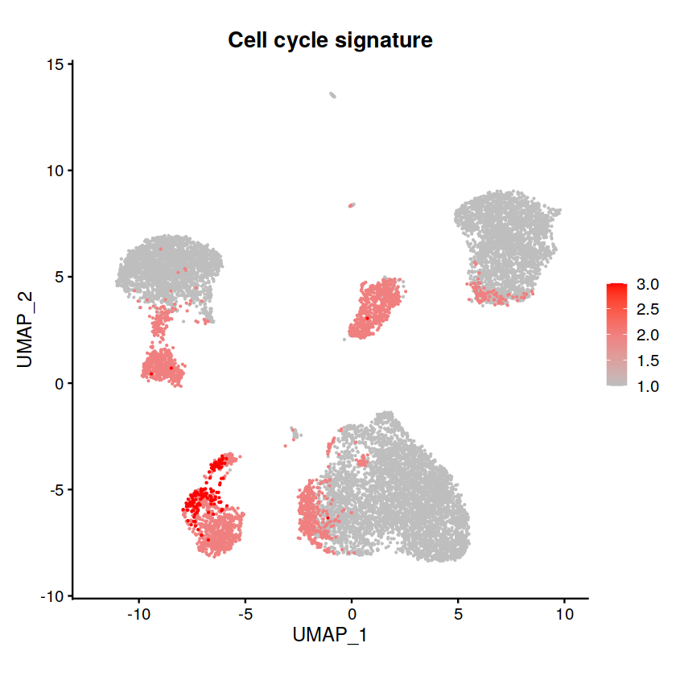

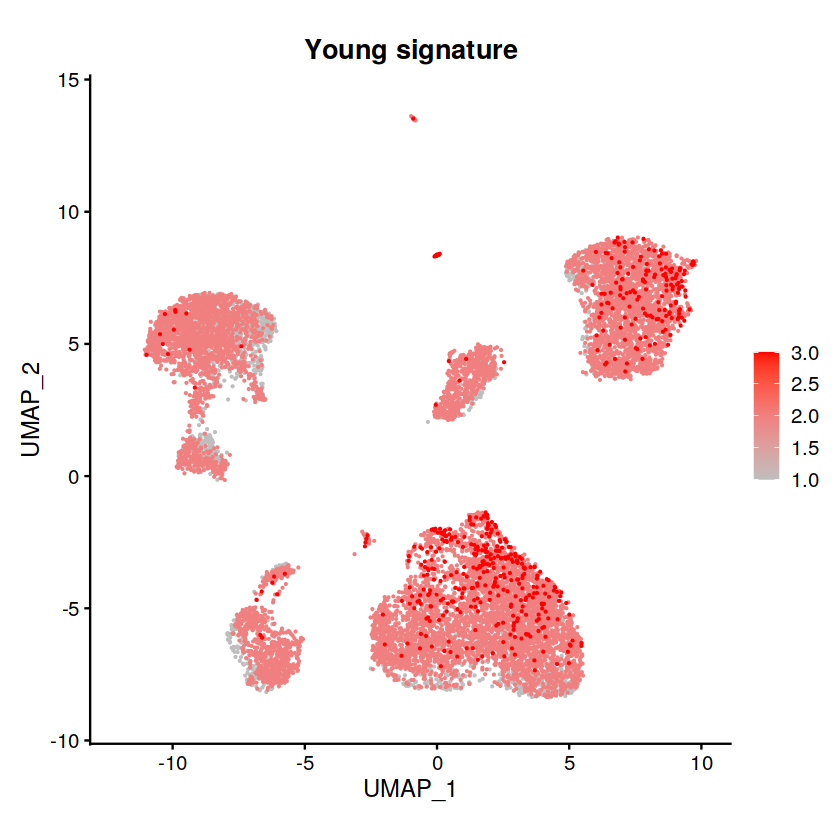

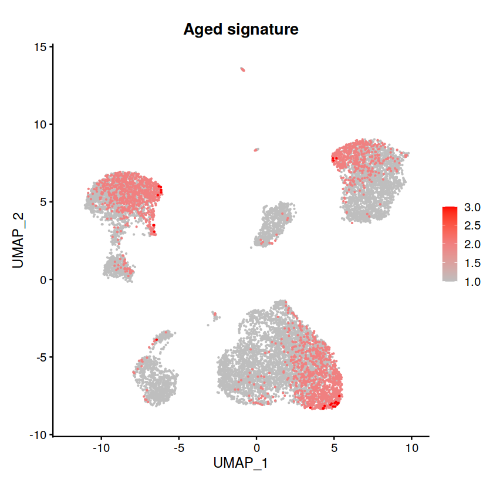

``` r
ggsave(cc, filename = str_c("plots/signature_", "cc", ".svg"),
    device = "svg", units = "in", width = 6, height = 6)
ggsave(young, filename = str_c("plots/signature_", "young", ".svg"),
    device = "svg", units = "in", width = 6, height = 6)
ggsave(aged, filename = str_c("plots/signature_", "aged", ".svg"),
    device = "svg", units = "in", width = 6, height = 6)
```
